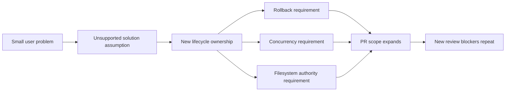
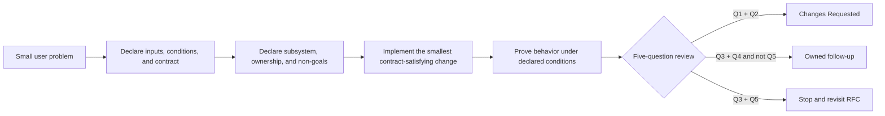

# Contributing to Ouroboros

Thank you for your interest in contributing to Ouroboros! This guide covers everything you need to get started.

## Table of Contents

- [Quick Setup](#quick-setup)
- [Development Workflow](#development-workflow)
- [Review Boundary Contract](#review-boundary-contract)
- [Ways to Contribute](#ways-to-contribute)
- [Development Environment](#development-environment)
- [Code Style Guide](#code-style-guide)
- [Commit Message Convention](#commit-message-convention)
- [Release Maintenance](#release-maintenance)
- [Project Structure](#project-structure)
- [Key Patterns](#key-patterns)
- [Documentation Coverage](#documentation-coverage)
  - [CLI Commands → Doc Mapping](#cli-commands--doc-mapping)
  - [Orchestrator → Doc Mapping](#orchestrator--doc-mapping)
  - [Capability Graph → Doc Mapping](#capability-graph--doc-mapping)
  - [Configuration → Doc Mapping](#configuration--doc-mapping)
  - [Evaluation Pipeline → Doc Mapping](#evaluation-pipeline--doc-mapping)
  - [TUI Source → Doc Mapping](#tui-source--doc-mapping)
  - [Skills / Plugin → Doc Mapping](#skills--plugin--doc-mapping)
  - [New Command or Flag Checklist](#new-command-or-flag-checklist)
  - [New Runtime Backend Checklist](#new-runtime-backend-checklist)
  - [Documentation Issue Severity Rubric](#documentation-issue-severity-rubric)
  - [Documentation Decay Detection](#documentation-decay-detection)
- [Contributor Docs](#contributor-docs)
- [Code of Conduct](#code-of-conduct)

---

## Quick Setup

> **First time?** See [Getting Started](./docs/getting-started.md) for full install options (Claude Code plugin, pip, or from source).

**Dev setup (from source):**

```bash
git clone https://github.com/Q00/ouroboros && cd ouroboros
```

Prepare a supported test environment with
[Testing Guide](./docs/contributing/testing-guide.md#prepare-an-environment).
Do not use `--all-extras`: the Claude SDK/MCP 1 profile and the MCP 2 server
profile are intentionally incompatible.

> **Environment setup is not the whole loop.** The checked-in `.mcp.json`
> points at the **published PyPI package**, so a clone that you edit is not the
> code your client runs. Before your first change, read
> [The Development Loop](./docs/contributing/developing.md).

**Requirements**: Python >= 3.12, [uv](https://github.com/astral-sh/uv). LiteLLM-bearing profiles support Python 3.12-3.13.

This repository's `.python-version` defaults source checkouts to **stable Python
3.14** for core local development. Python 3.12 is the pull-request parity
profile, and LiteLLM-bearing environments support Python 3.12-3.13. The Testing
Guide owns the executable profile selector.

---

## Development Workflow

### 1. Find or Create an Issue

- Check [GitHub Issues](https://github.com/Q00/ouroboros/issues) for open tasks
- For new features, open an issue first to discuss the approach
- Label your issue with appropriate tags: `bug`, `enhancement`, `documentation`, etc.
- Treat actionable issues as structured work artifacts, not casual notes. See [Issue Quality Policy](./docs/contributing/issue-quality-policy.md).

### 2. Branch

```bash
git checkout -b feat/your-feature   # for new features
git checkout -b fix/your-bugfix     # for bug fixes
git checkout -b docs/your-changes   # for documentation
```

### 3. Code

- Follow the project structure (see [Architecture for Contributors](./docs/contributing/architecture-overview.md))
- Use frozen dataclasses or Pydantic models for data
- Use the `Result[T, E]` type instead of exceptions for expected failures
- Write tests alongside your code

### 4. Test and Static Checks

Run the narrow owning test while iterating, then the non-mutating PR-parity
commands in [Testing Guide](./docs/contributing/testing-guide.md). Conditional
checks, including the `ooo auto` domain boundary and its documented escape
hatch, live in [CI Gates](./docs/contributing/ci-gates.md).

UserLevel plugins are domain-specific extensions dispatched through
`src/ouroboros/plugin/`; product-neutral `ooo auto` code must not absorb those
workflows.

### 5. Submit PR

`main` is protected — direct pushes are rejected for everyone, owner included.
Every change lands through a squash-merged PR.

- Write a clear PR description explaining **what** and **why**
- Include the structured boundary required by [Review Boundary Contract](#review-boundary-contract)
- Reference the related issue (e.g., `Closes #123`, or a plain `Refs #123`) —
  the `Issue link present` gate requires it
- Ensure all tests pass and linting is clean
- Wait for code review and address feedback

Four checks are required to merge (`Ruff Lint`, `MyPy Type Check`,
`Test Python 3.12`, `Bridge TypeScript`), and several more fire conditionally
on the paths you touched. Every gate, its local reproduction command, and its
legitimate escape hatch are documented in
[CI Gates and Branch Protection](./docs/contributing/ci-gates.md).

`ouroboros-agent[bot]` ties each review verdict to the commit it checked. It
grades your PR against the linked issue's requirements and reproduces the
defects it reports. Confirm the applicable verdict belongs to the current head,
then read
[Review Conventions](./docs/contributing/review-conventions.md) before your first
push — most review rounds are lost to objections you can preempt.

### Release Maintenance

The release sequence has one canonical home:
[CI Gates and Branch Protection](./docs/contributing/ci-gates.md#releases).
It owns metadata synchronization, `uv lock`, the release PR, post-merge tag
creation, generated notes, and the rule that PyPI publication runs only in CI.

---

## Review Boundary Contract

Review speed depends on whether the PR boundary is explicit. A focused PR gives contributors, review bots, and maintainers the same contract to evaluate. Every PR that changes code, documentation, or operational guidance MUST define the following before implementation and keep it current in the PR description:

| Boundary field | Required declaration |
|----------------|----------------------|
| User problem | One concrete user problem the PR solves |
| Promised contract | Supported inputs, preconditions, execution conditions, observable behavior, and invariants |
| Implementation boundary | Existing subsystems and components changed, data or security boundaries crossed, and the current owner |
| Non-goals | Unsupported inputs or conditions and related risks intentionally excluded from this PR |
| Evidence | Reproduction steps or tests that prove each promised behavior under the declared conditions |

The declared boundary narrows implementation scope; it MUST NOT waive an existing public or repository contract, an approved issue or RFC requirement, or a maintainer decision. If a proposed non-goal conflicts with one of those baseline obligations, the contributor MUST ask the maintainer to approve a scope change or revisit the RFC before implementation.

Do not begin from an unsupported solution assumption and then absorb every lifecycle, rollback, concurrency, or authority concern that follows from it. If implementation reveals a new subsystem or ownership boundary, stop and let a maintainer decide whether the PR expands, splits, or returns to RFC discussion.

### Responsibilities

- **Contributor**: declares the contract and boundary, keeps the implementation inside them, and does not silently widen either while addressing review feedback.
- **Review bot or reviewer**: blocks only direct contract violations and immediate user-data or security risks. A valid risk outside the declared boundary becomes a follow-up only when it has a named owner.
- **Maintainer**: decides whether a proposed subsystem, ownership change, or scope expansion belongs in the current PR, a follow-up PR, or a revised RFC.

### Five-question review rubric

Every finding MUST answer these questions with evidence:

1. Does the finding reproduce under the inputs and execution conditions promised by the PR?
2. Does the finding violate the contract promised by the PR?
3. Would resolving it require a new subsystem or a new ownership boundary?
4. Can the original user problem be solved without the subsystem introduced by the PR?
5. If the scope is split, does an immediate user-data or security risk remain?

Apply outcomes in this order:

| Evidence | Review outcome |
|----------|----------------|
| Questions 1 and 2 are **yes** | **Changes Requested**. The finding is reproducible inside the promised boundary and breaks the PR contract. |
| Question 5 is **yes**, but resolving the direct risk does not require a new subsystem or owner | **Changes Requested**. Immediate user-data and security risks introduced by the PR are blockers. |
| Questions 3 and 5 are **yes** | **Stop the PR and revisit the RFC with a maintainer**. The safe fix requires scope or ownership that the current PR cannot decide. |
| Questions 3 and 4 are **yes**, and question 5 is **no** | **Owned follow-up**. Create or link a follow-up issue or PR with a named owner; it is not a blocker once the current contract is satisfied. |
| The finding does not reproduce inside the declared conditions, or question 2 is **no** | **Not a blocker**. Record it only as an owned follow-up when it is independently valid and actionable. |

Severity alone does not decide whether a review comment blocks a PR. Boundary, contract impact, and immediate risk do.

### Why unstructured boundaries create review loops



### Preferred flow



---

## Ways to Contribute

### Bug Reports

Found a bug? Please open an issue with:

1. **Clear title**: Summarize the bug
2. **Impact**: Explain what is blocked or broken
3. **Description**: Steps to reproduce, expected vs actual behavior
4. **Acceptance criteria**: State what will be true once fixed
5. **Environment**: Python version, OS, `uv run ouroboros --version`
6. **Logs**: Relevant error messages or stack traces

See the [Issue Quality Policy](./docs/contributing/issue-quality-policy.md) for the full bug issue standard.

````markdown
## Summary
[What is broken]

## Impact
[Why this matters]

## Steps to Reproduce
1. Run `ooo interview "test"`
2. Enter X when prompted
3. Observe error

## Expected Behavior
[What should happen]

## Actual Behavior
[What happens instead]

## Acceptance Criteria for Fix
- [ ] [Condition that proves the bug is fixed]

## Environment
- Python: 3.12+
- Ouroboros: v0.9.0
- OS: macOS 15.2

## Logs
```
[paste error output]
```
````

### Feature Proposals

Have an idea? Open an issue only when it is structured enough to act on.

Feature issues should be written in a **PRD-lite** format with:

1. **Problem**: What problem exists today?
2. **Why now**: Why is this worth doing now?
3. **User / persona**: Who is affected?
4. **Current vs desired behavior**: What changes?
5. **Constraints and non-goals**: What boundaries matter?
6. **Acceptance criteria**: What would make this done?

If the idea is still fuzzy, use GitHub Discussions or Discord first, then turn it into a structured issue.

See the [Issue Quality Policy](./docs/contributing/issue-quality-policy.md) for the full feature issue standard.

### Pull Requests

When submitting a PR:

1. **Boundary declared**: State the user problem, promised contract, implementation boundary, non-goals, and evidence required by [Review Boundary Contract](#review-boundary-contract)
2. **Small, focused changes**: One logical change per PR
3. **Tests included**: New observable behavior needs contract-level tests
4. **Docs updated**: Update relevant documentation
5. **Clean history**: Squash commits before submitting if needed

### Documentation

Help improve docs by:

- Fixing typos and unclear explanations
- Adding examples to existing features
- Translating documentation (if you speak multiple languages)
- Creating tutorials or guides

When reporting or fixing a documentation problem, apply the [Documentation Issue Severity Rubric](#documentation-issue-severity-rubric): use the existing `documentation` label and add a `**Severity:** critical/high/medium/low` line so maintainers can triage and prioritise correctly.

### Code Review

Review open PRs using the [five-question review rubric](#five-question-review-rubric):

- Request changes only for contract violations or immediate user-data or security risks
- Move valid out-of-boundary risks to an owned follow-up instead of expanding the PR
- Escalate new subsystem or ownership requirements to a maintainer when they also carry immediate risk
- Suggest non-blocking improvements without presenting them as merge requirements

---

## Development Environment

### Environment Setup

```bash
# Copy environment template
cp .env.example .env

# Edit .env with your API keys
# Required: ANTHROPIC_API_KEY or OPENAI_API_KEY
```

### Running Tests

Use [Testing Guide](./docs/contributing/testing-guide.md) for the test topology,
hermetic `$HOME`, xdist isolation, targeted commands, CI parity, and real-surface
verification. Do not maintain another command matrix here.

### Pre-commit Hooks (Optional)

```bash
# Install pre-commit hooks
uv run pre-commit install

# Hooks run automatically on git commit
# Manual run:
uv run pre-commit run --all-files
```

---

## Code Style Guide

### Formatting

- **Line length**: 100 characters
- **Quotes**: Double quotes for strings
- **Indentation**: 4 spaces (no tabs)
- **Tool**: Ruff (auto-formats on save)

```bash
# Format code
uv run ruff format src/ tests/
```

### Type Checking

- **Tool**: mypy (Python 3.12 target)
- **Missing imports**: Ignored (`ignore_missing_imports = true`)
- See `pyproject.toml [tool.mypy]` for the full configuration

```bash
# Type check
uv run mypy src/ouroboros
```

### Linting

Ruff enforces:
- Pycodestyle (E, W)
- Pyflakes (F)
- isort (I)
- flake8-bugbear (B)
- flake8-comprehensions (C4)
- pyupgrade (UP)
- flake8-unused-arguments (ARG)
- flake8-simplify (SIM)

```bash
# Lint
uv run ruff check src/ tests/
```

### Python Version

- **Minimum supported**: Python 3.12
- **Test matrix**: Python 3.12, 3.13, and 3.14 for core/non-LiteLLM profiles; Python 3.12 and 3.13 for LiteLLM-bearing profiles
- **Source-checkout default**: `.python-version` selects stable Python 3.14 for local development
- Use the profile selector in the Testing Guide; do not combine dependency groups through `--all-extras`.
- Use modern Python features (type unions `|`, match statements, etc.)

---

## Commit Message Convention

We follow a simplified semantic commit format:

```
<type>(<scope>): <subject>

[optional body]
```

### Types

| Type | When to Use |
|------|-------------|
| `feat` | New feature |
| `fix` | Bug fix |
| `docs` | Documentation changes |
| `chore` | Build, tooling, dependency updates |
| `refactor` | Code refactoring (no behavior change) |
| `test` | Test changes |
| `perf` | Performance improvements |

### Scopes

Common scopes: `cli`, `tui`, `evaluation`, `orchestrator`, `mcp`, `plugin`, `core`

### Examples

```bash
# Feature
git commit -m "feat(evaluation): add consensus trigger for seed drift > 0.3"

# Bug fix
git commit -m "fix(tui): resolve crash when AC tree is empty"

# Docs
git commit -m "docs: update CLI reference with new flags"

# Refactor
git commit -m "refactor(orchestrator): extract parallel execution to separate module"
```

### Body (Optional)

For complex changes, add a body explaining the **why**:

```bash
git commit -m "feat(evaluation): add stage 3 consensus trigger

This enables multi-model voting when:
- Seed is modified during execution
- Ontology evolves significantly
- Drift score exceeds 0.3

Closes #42"
```

---

## Project Structure

The canonical ownership map is [Architecture for Contributors](./docs/contributing/architecture-overview.md).
It distinguishes authoring, runtime execution, verification, durable state,
read models, presentation and plugin boundaries using packages that exist on
the current tree.

The canonical test topology and isolation contract are in
[Testing Guide](./docs/contributing/testing-guide.md). In particular,
`tests/unit/mcp/` is hermetic even when a test starts a bounded loopback server
or subprocess; broader MCP server and multi-process coverage lives under
`tests/integration/mcp/`.

---

## Key Patterns

Detailed explanations: [Key Patterns](./docs/contributing/key-patterns.md)

### Result Type for Error Handling

```python
from ouroboros.core.types import Result

def validate_score(score: float) -> Result[float, ValidationError]:
    if 0.0 <= score <= 1.0:
        return Result.ok(score)
    return Result.err(ValidationError(f"Score {score} out of range"))

# Consume
result = validate_score(0.85)
if result.is_ok:
    process(result.value)
else:
    log_error(result.error.message)
```

### Frozen Dataclasses

```python
from dataclasses import dataclass

@dataclass(frozen=True, slots=True)
class CheckResult:
    check_type: CheckType
    passed: bool
    message: str
```

### Event Sourcing

```python
# Events are immutable and append-only
event = create_stage1_completed_event(execution_id="exec_123", ...)
await event_store.append(event)
```

### Protocol Classes

```python
from typing import Protocol

@runtime_checkable
class ExecutionStrategy(Protocol):
    def get_tools(self) -> list[str]: ...
```

---

## Documentation Coverage

Documentation follows the source that owns the observable contract. Do not add a
manually copied inventory of commands, runtimes, packages, or config fields when
the repository can derive that inventory in a contract test.

### Canonical Homes

| Change surface | Executable authority | Documentation home |
|---|---|---|
| CLI command or flag | `src/ouroboros/cli/main.py` and the owning command module | `docs/cli-reference.md`; `docs/getting-started.md` for common flows |
| Runtime or LLM backend | backend registries, `AgentRuntime.capabilities`, runtime/provider factories | runtime capability matrix, config reference, owning runtime guide |
| Config key or precedence | `src/ouroboros/config/models.py` and `loader.py` | `docs/config-reference.md`; developing/getting-started when workflow-visible |
| Evaluation behavior | `src/ouroboros/evaluation/` and orchestrator verification wiring | evaluation pipeline and execution-vs-evaluation guides |
| TUI interaction | screen `BINDINGS`, event reducers, widgets | TUI usage guide and its maintained translations |
| Skill or agent capability | root `skills/*/SKILL.md`, agent prompts, backend capability graph | skill capability guide and the owning workflow/runtime guide |
| UserLevel plugin contract | plugin schemas, firewall, lockfile and dispatch code | UserLevel plugin RFC and plugin-facing guides |
| Contributor workflow | workflows, scripts, tests and branch-protection API | contributor architecture, testing guide and CI gates |

### Source-Derived Contracts

The repository already checks several documentation relationships from source:

- `test_cli_surface_docs_contract.py` binds CLI registration to command claims.
- `test_runtime_skill_capability_docs.py` binds runtime registries to setup docs.
- `test_tui_usage_docs_contract.py` binds TUI bindings to English/Korean guides.
- `test_install_ref_docs_contract.py` binds installer examples to shell behavior.
- `test_contributor_context_docs_contract.py` rejects retired package context,
  orphaned root policy files, missing source paths and test-guide drift.

When adding a new public surface, extend the nearest source-derived contract
instead of appending another static mapping here.

### User-Visible Change Checklist

- [ ] Update the owning reference when observable behavior changes.
- [ ] Exercise the real CLI, MCP, runtime, plugin, or UI surface.
- [ ] Add or extend a source-derived documentation contract when a finite registry
      or schema can drift.
- [ ] Check all maintained locales when the same user-facing claim is duplicated.
- [ ] Record remaining documentation work in a GitHub issue with a named owner;
      do not maintain a second backlog file.

### Documentation Issue Severity Rubric

Severity determines urgency, not PR scope. Apply the
[Review Boundary Contract](#review-boundary-contract) before deciding whether a
documentation finding blocks the current change.

| Severity | Meaning | Typical effect |
|---|---|---|
| Critical | A documented command, path, flag, or safety step is wrong and causes failure or loss | Fix in the owning change when in boundary or immediate-risk; otherwise open an owned urgent issue |
| High | The reader can complete the step but reaches a materially wrong state or expectation | Changes requested only when it violates the declared/baseline contract |
| Medium | Ambiguous or inconsistent guidance with a working safe path | Non-blocking owned follow-up |
| Low | Cosmetic or alternate-path omission | Opportunistic follow-up |

Use the existing `documentation` label and state the severity and reproduced
user impact in the issue body.

### Documentation Decay Detection

1. Derive command, runtime, config, skill and binding inventories from source.
2. Treat the code, workflow, schema or branch-protection API as executable
   authority; docs explain it but do not override it.
3. Run the relevant docs contract tests plus the real documented command.
4. Reject placeholder, availability, path and precedence claims that cannot be
   reproduced on the current tree.
5. Move point-in-time plans to `docs/history/` and mark them non-normative rather
   than leaving them beside current work orders.

## Contributor Docs

- [Architecture Overview](./docs/contributing/architecture-overview.md) - How the system fits together
- [Testing Guide](./docs/contributing/testing-guide.md) - How to write and run tests
- [The Development Loop](./docs/contributing/developing.md) - Run your own code: local MCP, config, state, per-change verification
- [Review Conventions](./docs/contributing/review-conventions.md) - What the review bot demands, and how to preempt a round
- [Key Patterns](./docs/contributing/key-patterns.md) - Core patterns with code examples
- [CI Gates and Branch Protection](./docs/contributing/ci-gates.md) - What CI enforces, how to reproduce it locally, and how releases land

---

## Getting Help

- **GitHub Issues**: [Report bugs or request features](https://github.com/Q00/ouroboros/issues)
- **GitHub Discussions**: [Ask questions or share ideas](https://github.com/Q00/ouroboros/discussions)
- **Security Reports**: See [SECURITY.md](./SECURITY.md) before reporting vulnerabilities
- **Community Conduct**: See [CODE_OF_CONDUCT.md](./CODE_OF_CONDUCT.md)

---

## Code of Conduct

The canonical community rules live in [CODE_OF_CONDUCT.md](./CODE_OF_CONDUCT.md).

### Our Pledge

We pledge to make participation in our community a harassment-free experience for everyone, regardless of age, body size, disability, ethnicity, gender identity and expression, level of experience, nationality, personal appearance, race, religion, or sexual identity and orientation.

### Our Standards

**Positive behavior includes**:
- Being respectful and inclusive
- Gracefully accepting constructive criticism
- Focusing on what is best for the community
- Showing empathy towards other community members

**Unacceptable behavior includes**:
- Harassment, trolling, or derogatory comments
- Personal or political attacks
- Public or private harassment
- Publishing private information without permission
- Any other conduct which could reasonably be considered inappropriate

### Enforcement

Project maintainers may remove, edit, or reject comments, commits, code, wiki edits, issues, and other contributions that are not aligned with this Code of Conduct.

**Contact**: For any questions or concerns, please open a GitHub issue with the `conduct` label.

---

## License

By contributing to Ouroboros, you agree that your contributions will be licensed under the [MIT License](LICENSE).
