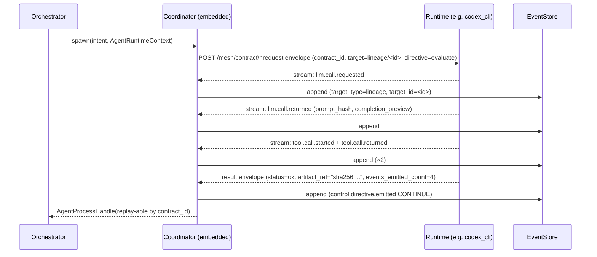

# RFC — MCP Mesh wire format and Coordinator handshake

> Status: **Accepted** (Phase 2 of #476 Agent OS roadmap).
> Closes [#511](https://github.com/Q00/ouroboros/issues/511).
> Related: [#471](https://github.com/Q00/ouroboros/issues/471) (Control vs Capability plane), [#476](https://github.com/Q00/ouroboros/issues/476) Q4 (dynamic MCP invariant), [#492](https://github.com/Q00/ouroboros/pull/492) (`control.directive.emitted`), [#436](https://github.com/Q00/ouroboros/pull/436) (`event_version`), [#517](https://github.com/Q00/ouroboros/issues/517), [#518](https://github.com/Q00/ouroboros/issues/518), [#519](https://github.com/Q00/ouroboros/issues/519).

## Summary

This RFC specifies the **wire layer** of the Mesh — the IPC-style channel that lets every harness (Claude Code, Codex CLI, OpenCode, Gemini CLI, Hermes, LiteLLM) attach to a single in-process Coordinator through one envelope shape, one polling discipline, and one ordering rule. It establishes the contract that Phase 3 implementation issues build against, and it formalizes how the runtime of the Phase-2 Agent OS (#476) actually moves bytes.

The RFC settles the *how* of the Mesh; the *what* (Contract = OS, Mesh = IPC, sub-agents as disposable processes) is settled by #476 itself.

## Scope

This document **does** decide:
- Transport, envelope schema, polling/push discipline, Coordinator topology, runtime registration handshake, ordering guarantees, and timeout/failure semantics.

This document **does not** decide:
- Per-runtime profile mappings (deferred to [#519](https://github.com/Q00/ouroboros/issues/519)).
- Disposable Memory's process model and artifact backend (deferred to [#512](https://github.com/Q00/ouroboros/issues/512); the companion RFC lands separately).
- Contract Ledger schema (deferred to [#513](https://github.com/Q00/ouroboros/issues/513); the companion RFC lands separately).
- The migration of `mcp_manager` plumbing to `AgentRuntimeContext + ControlBus` (tracked in [#474](https://github.com/Q00/ouroboros/issues/474) / [#475](https://github.com/Q00/ouroboros/issues/475)).

## Constraints inherited from #476

- **Local-first cooperative trust.** No daemon, no SaaS, no cross-tenant boundary. A misbehaving runtime *can* forge directives; the RFC does not police identity.
- **4-verb filter.** Every Mesh decision must strengthen exactly one of `replay / explain / steer / compose`. Decisions that fail this filter are rejected.
- **Tier-4 Won't.** The Mesh does not introduce real-time guarantees, multi-tenant isolation, or BFT.
- **Additive-only schemas.** [#436](https://github.com/Q00/ouroboros/pull/436)'s `event_version` rule applies to every envelope field added later.

## Decisions

### D1 — Transport: streamable-http (primary) + stdio multiplex (sub-process fallback)

**Decision.** All Mesh traffic flows over the `streamable-http` transport that ouroboros already uses for MCP ([#339](https://github.com/Q00/ouroboros/pull/339), [#485](https://github.com/Q00/ouroboros/pull/485)). For runtimes that already speak stdin/stdout (Codex CLI, Hermes, OpenCode, Gemini CLI), `stdio multiplex` is the local fallback. The Mesh adapter normalizes both into the same envelope shape so callers do not branch on transport.

**Rationale.** Reusing `streamable-http` keeps a single transport story across the codebase; UDS would force a Windows-incompatible split; raw TCP would invite firewall prompts on every workstation; SSE alone cannot carry bidirectional traffic; long-poll would require its own tuning loop. `stdio multiplex` covers exactly the runtimes whose existing pattern already speaks stdio.

**Risks.**
- Coupling to MCP's transport spec. Mitigation: a thin adapter layer quarantines `streamable-http` details so MCP changes only touch one file.
- Operator confusion when both transports are visible. Mitigation: `ouroboros mcp doctor` ([#445](https://github.com/Q00/ouroboros/pull/445)) prints the active transport per runtime in the resolved table.

### D2 — Envelope schema: ULID id + target binding + additive `extra` slot

Two envelopes — request (Coordinator → runtime) and result (runtime → Coordinator) — versioned and additive-only.

**Request envelope.**

```jsonc
{
  "schema_version": 1,
  "contract_id": "01HXAB...",            // ULID, 26 chars, sortable, no extra dependency
  "correlation_id": "01HXAC...",         // monotonic per chain
  "target_type": "lineage",              // values declared in events/control.py: session | execution | lineage | agent_process
  "target_id": "ralph-...-v3",
  "directive": "evaluate",               // core.directive.Directive.value (lowercase)
  "emitted_by": "orchestrator",
  "deadline_ms": 60000,                  // relative timeout duration in milliseconds
  "extra": {}                             // additive-only growth slot
}
```

**Result envelope.**

```jsonc
{
  "schema_version": 1,
  "contract_id": "01HXAB...",            // mirrored from request
  "correlation_id": "01HXAC...",         // mirrored from request
  "result": {
    "status": "ok",                       // "ok" | "error"
    "artifact_ref": "sha256:abc123...",   // content hash; body fetched separately
    "error": null                         // populated when status="error"
  },
  "runtime_id": "codex_cli",              // which harness produced the result
  "duration_ms": 12345,
  "events_emitted_count": 17,             // body via EventStore query, not inline
  "extra": {}
}
```

**Why ULID.** Sortable, log-friendly, 26-char ASCII, and synthesizable in 10 lines without a new dependency. Replaces UUIDv4 wherever event chains need to be reconstructed in order.

**Why `events_emitted_count` instead of inline events.** Disposable Memory's promise is that the *main session ledger holds only `contract_id + artifact_ref`*. Streaming an event count keeps the wire small; the body is fetched from the EventStore by a projector when needed. This preserves the bloat-guard invariant from [#512](https://github.com/Q00/ouroboros/issues/512) at the wire layer.

**`extra` governance.** Adding a key to `extra` requires a one-line justification in the PR body, identical to the narrow-membership commitment for `AgentRuntimeContext` in #476 Q1. This stops slot sprawl over time.

### D3 — Polling vs push: streamable-http hybrid

**Decision.** A request opens a POST against the Coordinator endpoint. The server streams *intermediate events* (`tool.call.*`, `llm.call.*` from [#517](https://github.com/Q00/ouroboros/issues/517)) and the *final result envelope* on the same connection, then closes.

**Rationale.** The slide framing of *"tool schema, polling, ResultEvent that act like IPC"* maps cleanly onto streamable-http: polling is implicit in the streaming response. No long-poll loop to tune, no SSE-only one-way limitation, no command channel separate from the data channel.

**Risks.**
- A single long-running stream ties up one connection per in-flight contract. Mitigation: `deadline_ms` is enforced server-side as a relative timeout from request receipt; abandoned streams are closed when the timeout expires regardless of client behavior.
- Reconnect semantics. Mitigation: clients reconnect with the same `(contract_id, correlation_id)`; D6 idempotency makes reconnection safe.

### D4 — Coordinator topology: embedded with abstract interface

**Decision.** The `Coordinator` lives inside the orchestrator process. A `Coordinator` Protocol/ABC isolates the in-process implementation from the rest of the orchestrator so a future daemon implementation can be substituted without touching call sites.

**Rationale.** Tier-4 Won'ts (no SaaS, no real-time, single-machine) make a separate daemon infrastructure for goals we have explicitly declined. The abstract interface keeps the door open for a Phase 4+ multi-machine extraction at exactly one cost: the day someone wants distributed runtimes, they replace one implementation.

**Risks.**
- Single-process bottleneck. Mitigation: Tier-4 Won't makes this a non-goal; the abstract interface is the planned escape valve.
- Implicit lifetime coupling between Coordinator and orchestrator session. Mitigation: the abstract interface defines lifetime hooks (`start()`, `stop()`) so a future daemon does not need to inherit session boundaries.

### D5 — Runtime registration: startup + #476 Q4 invariant verbatim

**Startup handshake.** At orchestrator start, the Coordinator reads the binding table from [#519](https://github.com/Q00/ouroboros/issues/519) (`runtime_profile.stages`), opens one channel per declared runtime using that runtime's resolved transport (streamable-http for in-process/server runtimes, stdio multiplex through the Mesh adapter for stdin/stdout CLI runtimes), and each runtime advertises:

```jsonc
{
  "runtime_id": "codex_cli",
  "version": "0.31.0",
  "supported_directives": ["evaluate", "evolve", "retry", "cancel", "converge"],
  "supported_target_types": ["lineage", "execution", "agent_process"],
  "capabilities": [/* CapabilityRegistry wire format */]
}
```

**Dynamic addition** reuses the contract from #476 Q4 verbatim. This RFC does not invent anything new on this path — it simply requires the Mesh to honor the existing invariant.

```
1. mcp_bridge.add_server(config)               — transport + discovery
2. CapabilityRegistry.sync_from(bridge)        — typed capabilities
3. PolicyEngine.evaluate(role, phase, ...)     — policy decision set
4. Emit policy.capabilities.changed            — diff summary event
5. ControlBus subscribers re-read on next turn
```

**Invariant.** *If step 4 did not emit, step 5 must not see the capability.*

### D6 — Ordering: FIFO per `contract_id` + at-least-once + idempotent handlers

This is the single decision that introduces fresh semantics; all others either inherit or follow naturally.

**Decision.**

- **FIFO per `contract_id`.** Directives within one contract chain are delivered and journaled in emission order. Cross-contract ordering is *not* guaranteed; that is the parallelism unlock.
- **At-least-once delivery.** Timeout → the Coordinator retries the same `(contract_id, correlation_id)` while budget remains. No exactly-once machinery.
- **Idempotency obligation on handlers.** A handler that receives a duplicate `(contract_id, correlation_id)` returns the cached result instead of re-executing. Cache lifetime equals the contract's lifetime (cleared at completion or cancellation).
- **LLM non-determinism resolution.** The *first* response is cached by `(contract_id, correlation_id)`; retries return the cache. *Intentional* re-execution allocates a new `contract_id` (matches `--force-rerun` semantics in [#512](https://github.com/Q00/ouroboros/issues/512) C5).

**Cache backend.** Filesystem-keyed under `.ouroboros/cache/contracts/<contract_id>/` so it aligns with Disposable Memory's content-addressed `artifact_ref` story. SQLite-backed alternatives are deferred until usage evidence demands them.

**Why this matters.** Replay from the journal is the *replay* verb in #476's north star. If FIFO per contract is not honored, replays diverge from the recorded run. If at-least-once is not honored, transient failures produce silent gaps. If idempotency is not enforced, retries produce duplicate work and user-visible non-determinism. All three exist together or not at all.

**Risks.**
- Idempotency cache vs. genuine re-execution intent. Mitigation: the rule "retries reuse the cache; new runs allocate new `contract_id`" is documented in this RFC and enforced by the Disposable Memory replay default.
- Cache eviction during a long contract. Mitigation: cache lifetime = contract lifetime, not a TTL; eviction only happens on contract completion or cancellation.

### D7 — Timeout and failure: per-stage policy + Directive mapping

Configurable per stage via the binding table from [#519](https://github.com/Q00/ouroboros/issues/519):

```toml
[orchestrator.runtime_profile.stages.evaluate]
runtime = "claude_code"
timeout_ms = 90000
retry_budget = 2
on_timeout = "retry"        # "retry" or "cancel"
```

**Failure → Directive mapping.**

| Failure mode | Directive | Notes |
|---|---|---|
| Runtime exceeded `deadline_ms` | `retry` while budget remains, then `cancel` | Budget owned by the existing resilience layer |
| Runtime crash / connection drop | `cancel` immediately | Cooperative trust: do not assume retry safety after process death; this is not the D6 retry path |
| Schema validation failure on result envelope | `cancel` | Malformed envelope is not retryable |
| Runtime explicitly returned `wait` | propagate `wait` | External input dependency surfaced to operator |

The retry budget reuses the existing resilience layer's accounting — no new budget surface is introduced.

## Sequence diagram — one contract round trip



## Cross-RFC consistency

| Subject | Source | This RFC's behaviour |
|---|---|---|
| `contract_id = ULID` | this RFC, D2 | Inherited by [#513](https://github.com/Q00/ouroboros/issues/513) |
| `artifact_ref = "sha256:..."` | [#512](https://github.com/Q00/ouroboros/issues/512) C2 | Used in result envelope (D2) |
| Replay does not re-execute LLM calls | #476 M3 + #518 | Honored by D6 idempotency cache |
| `target_type` vocabulary | events/control.py (#492) | Authoritative in this RFC's D2 |
| `policy.capabilities.changed` invariant | #476 Q4 | Reused verbatim in D5 |

## Pre-merge checklist

- [ ] All 7 decisions present, each with option, rationale, risks
- [ ] Envelope JSONC blocks lint as valid JSON when comments are stripped
- [ ] Sequence diagram renders (mermaid) and matches the textual description
- [ ] Cross-references resolve to existing issues / lines
- [ ] At least two maintainer approvals on the docs PR
- [ ] D6 sub-thread (idempotency cache backend) resolved; resolution captured here
- [ ] D2 `extra` slot governance rule explicitly stated
- [ ] `contract_id = ULID` matches what `contract-ledger.md` (#513) inherits
- [ ] `artifact_ref = "sha256:..."` matches what `disposable-memory.md` (#512) chose
- [ ] Failure → Directive mapping matches the body of [#518](https://github.com/Q00/ouroboros/issues/518) cancellation discipline

## Post-merge checklist

- [ ] `docs/rfc/mesh.md` reachable from the docs site (or the README index when it lands)
- [ ] Issue [#511](https://github.com/Q00/ouroboros/issues/511) closed with a back-link to this PR
- [ ] At least three Phase 3 implementation issues opened referencing this RFC by section (Coordinator service, ResultEvent envelope, runtime registration handshake)
- [ ] `policy.capabilities.changed` invariant from D5 confirmed against the existing dynamic-MCP code path with one manual smoke run

## Rollback

The deliverable is a docs PR with no runtime impact. Rollback = revert the docs PR. No data, schema, or behavior change to undo. The proposal comment in [#511](https://github.com/Q00/ouroboros/issues/511) remains as the working draft so subsequent attempts can iterate from the same starting point.
