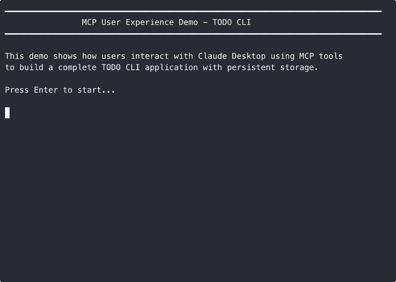

# MCP Demo: TODO CLI Application

This example demonstrates how users interact with Claude Desktop using Ouroboros MCP tools to build a complete TODO CLI application.

## 📹 Demo Video



**What you're seeing:**
1. 👤 User requests a TODO CLI app from Claude Desktop
2. 🤖 Claude uses the `ouroboros_execute_seed` MCP tool
3. 📺 **Real-time progress display** in MCP server terminal:
   - Acceptance criteria status tracking (⏳ → 🔄 → ✅)
   - Progress spinner and elapsed time
   - Live session metrics (49 messages, 105 seconds)
4. ✅ Complete application delivered with tests

## About This Demo

**Seed:** `todo_cli_seed.yaml`

Builds a complete command-line TODO application with:
- **6 acceptance criteria**
- CLI with subcommands (add/list/complete)
- JSON-based persistent storage
- Error handling for edge cases
- Comprehensive test suite
- **~2 minutes execution time**

This demonstrates real-world complexity where the orchestrator overhead is justified by the task complexity.

## Running the Demo

### Option 1: Watch the Recording (Quickest)

The GIF above shows the complete flow (2x speed). For the full-speed terminal recording:

```bash
asciinema play examples/mcp_demo/todo_cli_demo.cast
```

**Playback controls:**
- `Space`: Pause/resume
- `q`: Quit
- `.`: Step forward one frame

### Option 2: Run It Yourself (Live Execution)

```bash
# From repo root
uv run ouroboros run workflow --orchestrator examples/mcp_demo/todo_cli_seed.yaml
```

You'll see the same real-time progress display as the demo shows.

## Re-recording the Demo

If you want to modify and re-record:

```bash
# Edit the seed
vim todo_cli_seed.yaml

# Re-record
./record_todo_cli.sh

# Convert to GIF
brew install agg
agg todo_cli_demo.cast todo_cli_demo.gif --speed 2
```

## What Makes a Good Demo Seed?

**This TODO CLI example demonstrates ideal complexity:**
- ✅ Multiple meaningful acceptance criteria (6)
- ✅ Mix of file operations, logic, and testing
- ✅ Takes 1-2 minutes to complete
- ✅ Shows clear progress updates
- ✅ Produces a usable application

**Avoid:**
- ❌ Too simple (hello world) - mostly orchestrator overhead
- ❌ Too complex (>10 min) - recordings become unwieldy

## Architecture Notes

When Claude Desktop calls `execute_seed` via MCP:

```
Claude Desktop
    ↓ (MCP protocol)
MCP Server (FastMCP)
    ↓
ExecuteSeedHandler
    ↓
OrchestratorRunner ← Real-time progress display here!
    ↓
Claude Agent SDK
    ↓
Anthropic API
```

The progress display runs in the **MCP server's terminal**, not in Claude Desktop. This gives developers visibility into what's happening during long-running operations.

## Files

- **`todo_cli_seed.yaml`** - Seed definition with 6 acceptance criteria
- **`todo_cli_demo.gif`** - Animated demo (206KB, 2x speed)
- **`todo_cli_demo.cast`** - Terminal recording (147KB, full speed)
- **`demo_todo_cli.sh`** - Script simulating user experience
- **`record_todo_cli.sh`** - Script to re-record the demo

## Tips

- Use `--overwrite` flag when re-recording to replace existing .cast files
- Recordings are JSON-based and can be edited manually if needed
- Upload to asciinema.org for easy sharing: `asciinema upload demo.cast`
