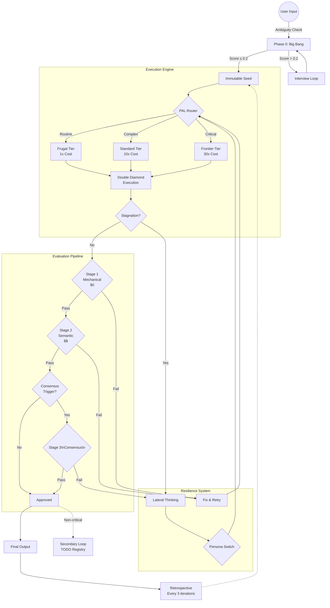

# Ouroboros v0.4: Executive Summary

**Philosophy**: "Frugal by Default, Rigorous in Verification"  
**Status**: Implementation Ready  
**Goal**: Zero-Human-Intervention Self-Improving Workflow

---

## 1. The Core Concept

Ouroboros는 비용 효율적인 **"Frugal Execution"**과 엄격한 **"Consensus Verification"**을 결합한 자율 에이전트 시스템입니다.

### Core Value Proposition

| Value | Description | Mechanism |
|-------|-------------|-----------|
| **Cost Efficiency** | 일상 업무는 저비용 모델이 처리 → 비용 **1/30** 절감 | Tiered Routing (1x Cost) |
| **Clear Start** | 모호한 입력 차단 → GIGO 방지 | Ambiguity Gate (≤ 0.2) |
| **Resilience** | 오류 시 페르소나 전환으로 정체 돌파 | Lateral Thinking |
| **Quality Assurance** | 중요 결정에만 다중 모델 합의 | 3-Stage Evaluation |

---

## 2. High-Level Architecture



---

## 3. Economic Model (Tiered Routing)

| Tier | Cost Factor | Intelligence | Models (Example) | Use Cases |
|------|-------------|--------------|------------------|-----------|
| **Frugal** | **1x** | 9~11 | GPT-4o-mini, Gemini Flash, Haiku | 루틴 코딩, 로그 분석, Stage 1 수정 |
| **Standard** | **10x** | 14~16 | GPT-4o, Claude Sonnet, Gemini Pro | 논리 설계, Stage 2 평가, 인터뷰 |
| **Frontier** | **30x+** | 18~20 | o3, Claude Opus | Consensus, Lateral Thinking, Big Bang |

### Routing Rules

```
1. DEFAULT: 모든 작업은 Frugal에서 시작
2. ESCALATE: 2회 연속 실패 시 상위 Tier로 승격
3. DOWNGRADE: 5회 연속 성공 시 하위 Tier로 강등
4. CRITICAL: Consensus 필요 시 즉시 Frontier 할당
```

---

## 4. Key Mechanisms

### 4.1 Ambiguity Gate

사용자의 모호한 요구사항(Ambiguity > 0.2)은 시스템 진입 원천 차단.

```
Ambiguity Score:
  0.0: 완전히 명확 (기계 검증 가능)
  0.2: 충분히 명확 ← GATE (실행 허용)
  0.5: 보통 (추가 질문 필요)
  1.0: 완전히 모호 (해석 불가)
```

### 4.2 3-Stage Evaluation Pipeline

| Stage | Cost | Model | Purpose | Pass Condition |
|-------|------|-------|---------|----------------|
| **Stage 1** | $0 | None | Lint, Build, Test | All checks pass |
| **Stage 2** | $$ | Standard | AC 준수, Goal 정렬 | Score ≥ 0.8 |
| **Stage 3** | $$$$ | Frontier ×3 | 다중 모델 합의 | 2/3 Majority |

### 4.3 Consensus Trigger Matrix

| Scenario | Consensus? | Reason |
|----------|------------|--------|
| Routine AC 완료 | ❌ NO | Stage 2로 충분 |
| Stage 1 실패 | ❌ NO | 기계적 오류는 토론 불필요 |
| **Final Delivery** | ✅ YES | 되돌릴 수 없는 결정 |
| **Ontology Change** | ✅ YES | 시스템 세계관 영향 |
| **Lateral Adoption** | ✅ YES | 전략 변경 승인 |
| **Seed Drift Alert** | ✅ YES | 방향 이탈 판정 |

### 4.4 Lateral Thinking Personas

정체(Stagnation) 감지 시 페르소나 전환으로 돌파:

| Persona | Strategy |
|---------|----------|
| **The Hacker** | "우아함은 버려라. 하드코딩이라도 작동하게 만들어라." |
| **The Researcher** | "코딩을 멈춰라. 문서와 외부 검색에만 집중하라." |
| **The Simplifier** | "기능을 절반으로 줄여라. MVP로 돌아가라." |
| **The Architect** | "아키텍처를 의심하라. 기본 원리부터 다시 생각하라." |

---

## 5. Document Structure

이 패키지는 3개 문서로 구성됩니다:

| File | Audience | Purpose |
|------|----------|---------|
| `1_EXECUTIVE_SUMMARY.md` | PM, 경영진 | 핵심 개념, 비용 구조, 시각화 |
| `2_FULL_SPECIFICATION.md` | 개발자 | 인터페이스, 알고리즘, 상세 로직 |
| `3_CONFIG_TEMPLATE.yaml` | DevOps | 즉시 적용 가능한 설정 |

---

## 6. Version History

| Version | Date | Key Changes |
|---------|------|-------------|
| v0.1 | 2026-01-12 | 기본 구조 (Seed, AC, Double Diamond) |
| v0.2 | 2026-01-12 | 운영 안정성 (PAL, Stagnation, Persistence) |
| v0.3 | 2026-01-12 | 비용 최적화 (Ambiguity, 3-Stage, Trigger Matrix) |
| **v0.4** | 2026-01-12 | 통합 패키지 (Cost Factors, Mermaid, 계층적 문서) |

---

*For implementation details, see `2_FULL_SPECIFICATION.md`*
