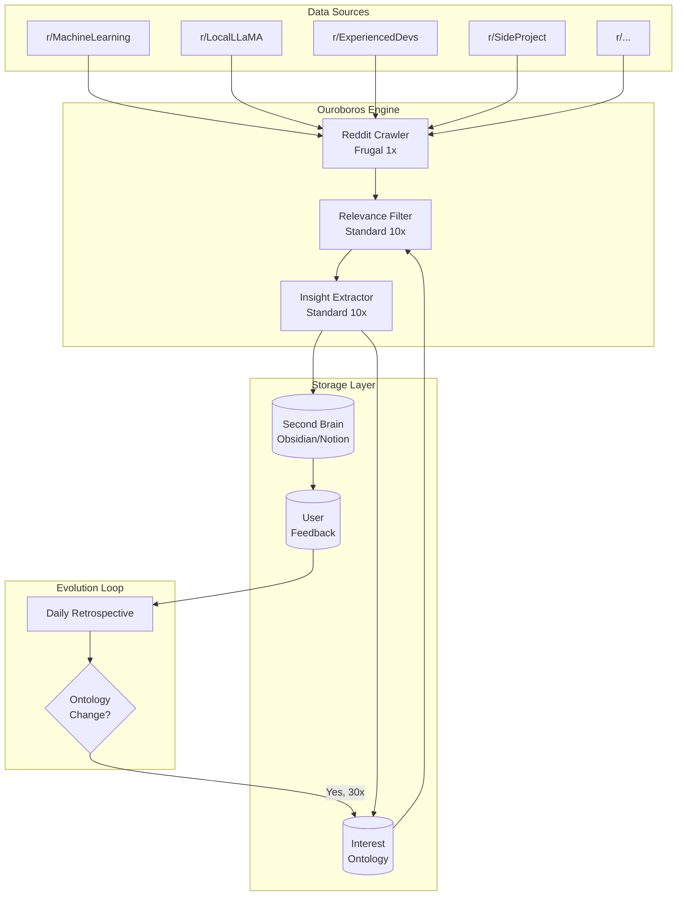
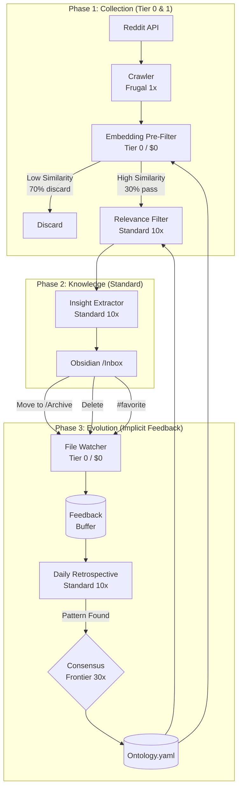

# Ouroboros Example App: Reddit Second Brain

## Self-Evolving Knowledge Curator

**App Version**: 1.1  
**Ouroboros Version**: 0.4+  
**Use Case**: 24/7 Reddit 크롤링 → 개인화된 세컨드 브레인 구축

---

## Table of Contents

1. [Overview](#1-overview)
2. [Architecture](#2-architecture)
3. [Seed Definition](#3-seed-definition)
4. [Tools Specification](#4-tools-specification)
5. [Execution Flow](#5-execution-flow)
6. [Self-Improvement Mechanisms](#6-self-improvement-mechanisms)
7. [Configuration](#7-configuration)
8. [Implementation](#8-implementation)
9. [Cost Analysis](#9-cost-analysis)
10. [Deployment](#10-deployment)

---

## 1. Overview

### 1.1 What It Does

Reddit Second Brain은 Ouroboros 프레임워크를 활용하여:

1. **24시간 무중단**으로 지정된 서브레딧을 크롤링
2. **Tier 0 사전 필터**로 70% 비용 절감 ⭐ v1.1
3. **개인 관심사**에 맞는 글만 필터링
4. **인사이트 추출** 후 세컨드 브레인(Obsidian)에 저장
5. **Implicit Feedback**으로 파일 정리만으로 자동 학습 ⭐ v1.1
6. **온톨로지 진화**로 새로운 관심사 자동 발견

### 1.2 v1.1 Key Improvements

| Feature | v1.0 | v1.1 |
|---------|------|------|
| **Pre-filtering** | LLM only ($300/month) | Tier 0 embedding ($50-193/month) |
| **Feedback** | CLI 입력 필요 | 파일 이동/삭제로 자동 수집 |
| **UX Friction** | High | Zero |
| **Cost** | $300/month | $50-193/month |

### 1.3 Why Ouroboros?

| 일반 크롤러 | Ouroboros 기반 |
|------------|---------------|
| 정적 규칙 기반 필터링 | 학습하는 온톨로지 |
| 오류 시 중단 | Lateral Thinking으로 우회 |
| 일정 비용 | Tier 0 (0x) ~ Frontier (30x) 동적 배분 |
| 수동 피드백 입력 | Implicit Feedback (Zero Friction) |

### 1.4 Core Value

```
"Obsidian에서 평소처럼 파일만 정리하면,
 시스템이 알아서 내 관심사를 학습하고 진화한다."
```

---

## 2. Architecture

### 2.1 System Diagram



### 2.2 Component Mapping

| Ouroboros Component | Reddit Brain 적용 |
|--------------------|------------------|
| **Seed** | 초기 관심사, 서브레딧 목록, 품질 기준 |
| **PAL Router** | 크롤링(1x), 필터링(10x), 합의(30x) |
| **Double Diamond** | 수집→필터→분석→저장 사이클 |
| **Stagnation Detection** | 같은 패턴 반복 감지 |
| **Lateral Thinking** | API 실패 시 우회, 새 서브레딧 탐색 |
| **Consensus** | 온톨로지 변경 승인 |
| **Secondary Loop** | "나중에 읽을 글" 축적 |
| **Retrospective** | 일일 학습 및 개선 |

---

## 3. Seed Definition

### 3.1 Complete Seed YAML

```yaml
# seeds/reddit-brain-v1.yaml

seed:
  id: "reddit-brain-v1"
  created_at: "2026-01-12"
  ambiguity_score: 0.15  # ≤ 0.2 requirement met
  version: "1.0"
  
  # ─────────────────────────────────────────────────────────────
  # Goal Definition
  # ─────────────────────────────────────────────────────────────
  goal:
    statement: |
      Reddit에서 AI/개발/생산성 관련 고품질 정보를 24시간 수집하여
      개인화된 세컨드 브레인을 구축한다.
      시스템은 사용자 피드백을 학습하여 점진적으로 
      더 정확하고 관련성 높은 정보만 필터링한다.
      
    success_metrics:
      - name: "daily_useful_posts"
        description: "하루 유용한 글 수집량"
        target: 10
        measurement: "posts marked as useful by user"
        verification: "automated"
        
      - name: "precision"
        description: "수집 정확도"
        target: 0.8
        measurement: "useful_posts / total_collected"
        verification: "automated"
        
      - name: "recall_improvement"
        description: "놓친 좋은 글 감소율"
        target: "10% monthly improvement"
        measurement: "user manually added posts"
        verification: "manual"
        
      - name: "ontology_freshness"
        description: "관심사 업데이트 주기"
        target: "weekly"
        measurement: "ontology modification events"
        verification: "automated"
        
    scope:
      includes:
        - "Reddit public posts"
        - "Post titles, content, comments (top 5)"
        - "User-defined subreddits"
        - "Cross-post discovery"
      excludes:
        - "Private subreddits"
        - "NSFW content"
        - "Deleted posts"
        - "Full comment threads"

  # ─────────────────────────────────────────────────────────────
  # Constraints
  # ─────────────────────────────────────────────────────────────
  constraints:
    hard:
      - id: "rate_limit"
        description: "Reddit API rate limit compliance"
        rule: "max 100 requests per minute"
        
      - id: "no_duplicates"
        description: "No duplicate content"
        rule: "check post_id before storage"
        
      - id: "data_retention"
        description: "Respect Reddit ToS"
        rule: "no bulk data resale"
        
    soft:
      - id: "upvote_threshold"
        description: "Prefer quality posts"
        rule: "prefer posts with score >= 10"
        weight: 0.7
        
      - id: "recency"
        description: "Prefer recent content"
        rule: "prefer posts < 7 days old"
        weight: 0.8
        
      - id: "language"
        description: "Language preference"
        rule: "English preferred, Korean accepted"
        weight: 0.6

  # ─────────────────────────────────────────────────────────────
  # Initial Ontology (Will Evolve)
  # ─────────────────────────────────────────────────────────────
  ontology:
    version: "1.0"
    
    interests:
      primary:
        - concept: "AI Agents"
          keywords: ["autonomous agent", "AI agent", "agentic", "multi-agent"]
          weight: 1.0
          
        - concept: "LLM Applications"
          keywords: ["LLM", "GPT", "Claude", "fine-tuning", "RAG", "prompt engineering"]
          weight: 1.0
          
        - concept: "System Design"
          keywords: ["architecture", "scalability", "distributed", "microservices"]
          weight: 0.9
          
        - concept: "Developer Productivity"
          keywords: ["workflow", "automation", "CLI tools", "dev tools"]
          weight: 0.8
          
      secondary:
        - concept: "Startup Insights"
          keywords: ["founder", "startup", "MVP", "product market fit"]
          weight: 0.6
          
        - concept: "Career Growth"
          keywords: ["senior engineer", "staff engineer", "tech lead", "career"]
          weight: 0.5
          
    exclude:
      explicit:
        - pattern: "meme"
          reason: "Low signal"
        - pattern: "job posting"
          reason: "Not learning content"
        - pattern: "hiring"
          reason: "Not learning content"
        - pattern: "salary"
          reason: "Not primary interest"
          
      learned: []  # Will be populated by feedback
      
    subreddits:
      active:
        - name: "MachineLearning"
          priority: 1
          scan_frequency: "hourly"
          
        - name: "LocalLLaMA"
          priority: 1
          scan_frequency: "hourly"
          
        - name: "ChatGPT"
          priority: 2
          scan_frequency: "2h"
          
        - name: "ExperiencedDevs"
          priority: 2
          scan_frequency: "2h"
          
        - name: "SideProject"
          priority: 3
          scan_frequency: "4h"
          
      candidates: []  # Discovered but not yet activated
      
    connections:
      # Concept relationships for graph building
      - from: "AI Agents"
        to: "LLM Applications"
        relation: "uses"
        
      - from: "System Design"
        to: "AI Agents"
        relation: "enables"

  # ─────────────────────────────────────────────────────────────
  # Evaluation Principles
  # ─────────────────────────────────────────────────────────────
  evaluation:
    relevance_criteria:
      - name: "novelty"
        question: "Does it teach something I don't know?"
        weight: 0.3
        
      - name: "actionability"
        question: "Can I apply this to my work?"
        weight: 0.3
        
      - name: "depth"
        question: "Is this surface-level or insightful?"
        weight: 0.2
        
      - name: "credibility"
        question: "Is the source trustworthy?"
        weight: 0.2
        
    quality_signals:
      positive:
        - "Code examples included"
        - "Personal experience shared"
        - "Data or benchmarks provided"
        - "Contrarian but well-argued view"
        
      negative:
        - "Pure opinion without evidence"
        - "Promotional content"
        - "Outdated information"
        - "Clickbait title"
        
    feedback_loop:
      positive_action: "User marks as useful"
      positive_effect: "Strengthen related interest weights"
      
      negative_action: "User dismisses"
      negative_effect: "Weaken or add to exclude list"
      
      threshold_for_ontology_change: 5  # N consistent signals

  # ─────────────────────────────────────────────────────────────
  # Exit Conditions
  # ─────────────────────────────────────────────────────────────
  exit_conditions:
    success:
      - condition: "User manually stops"
        action: "graceful_shutdown"
        
    failure:
      - condition: "Reddit API permanently blocked"
        action: "notify_and_pause"
        
      - condition: "Storage full"
        action: "archive_old_and_continue"
        
    timeout:
      max_runtime: "unlimited"  # 24/7 operation
      checkpoint_interval: "1h"
```

### 3.2 Seed Validation

```python
# Ambiguity check passes:
# - Success metrics: All measurable ✓
# - Constraints: Clear rules ✓
# - Scope: Well-defined boundaries ✓
# - Technical: Specific APIs and tools ✓
# → Ambiguity Score: 0.15 ≤ 0.2 ✓
```

---

## 4. Tools Specification

### 4.1 Tool Registry

| Tool | Tier | Cost | Purpose |
|------|------|------|---------|
| `reddit_crawler` | Frugal | 1x | 서브레딧 크롤링 |
| `embedding_prefilter` | **Zero** | **0x** | 로컬 임베딩 사전 필터 ⭐ NEW |
| `relevance_filter` | Standard | 10x | LLM 관련성 판단 |
| `insight_extractor` | Standard | 10x | 인사이트 추출 |
| `brain_writer` | Frugal | 1x | 세컨드 브레인 저장 |
| `implicit_feedback` | **Zero** | **0x** | 파일 감시 자동 피드백 ⭐ NEW |
| `ontology_updater` | Frontier | 30x | 온톨로지 변경 (Consensus) |

### 4.2 Tier 0: Embedding Pre-Filter ⭐ NEW

**핵심 아이디어**: LLM 호출 전에 로컬 임베딩 모델로 70% 사전 탈락 → 비용 1/10 절감

```python
# tools/embedding_prefilter.py

from ouroboros.tools import MCPTool, ToolResult
from ouroboros.routing import Tier
from sentence_transformers import SentenceTransformer
import numpy as np

class EmbeddingPrefilterTool(MCPTool):
    """
    로컬 임베딩 모델을 사용하여 LLM 호출 전 사전 필터링.
    
    Tier: ZERO (비용 $0) - 로컬 모델만 사용
    
    효과: 250개 글 중 70%를 LLM 없이 탈락 → 75개만 Standard 모델로 전달
    """
    
    name = "embedding_prefilter"
    description = "Pre-filter posts using local embedding similarity"
    tier = Tier.ZERO  # No LLM cost
    
    def __init__(self, config: dict):
        # 경량 임베딩 모델 (로컬 실행, 무료)
        self.model = SentenceTransformer('all-MiniLM-L6-v2')
        self.similarity_threshold = config.get("threshold", 0.3)
        
        # 온톨로지 임베딩 캐시
        self._ontology_embeddings = None
        
    async def execute(self, params: dict) -> ToolResult:
        """
        Args:
            params:
                posts: list[dict] - 크롤링된 글 목록
                ontology: dict - 현재 온톨로지
                top_percent: float - 상위 N% 통과 (default: 30%)
        
        Returns:
            ToolResult with pre-filtered posts
        """
        posts = params["posts"]
        ontology = params["ontology"]
        top_percent = params.get("top_percent", 0.30)
        
        # 1. 온톨로지 키워드를 임베딩으로 변환 (캐시)
        ontology_text = self._build_ontology_text(ontology)
        ontology_embedding = self.model.encode(ontology_text)
        
        # 2. 각 포스트의 유사도 계산
        scored_posts = []
        for post in posts:
            post_text = f"{post['title']} {post['content'][:500]}"
            post_embedding = self.model.encode(post_text)
            
            # Cosine similarity
            similarity = np.dot(ontology_embedding, post_embedding) / (
                np.linalg.norm(ontology_embedding) * np.linalg.norm(post_embedding)
            )
            
            scored_posts.append({
                "post": post,
                "embedding_score": float(similarity)
            })
        
        # 3. 상위 N%만 통과
        scored_posts.sort(key=lambda x: x["embedding_score"], reverse=True)
        cutoff_index = int(len(scored_posts) * top_percent)
        passed = scored_posts[:cutoff_index]
        discarded = scored_posts[cutoff_index:]
        
        return ToolResult(
            success=True,
            data={
                "passed_posts": [p["post"] for p in passed],
                "passed_scores": [p["embedding_score"] for p in passed],
                "input_count": len(posts),
                "output_count": len(passed),
                "discard_count": len(discarded),
                "filter_rate": 1 - top_percent
            },
            metadata={
                "model": "all-MiniLM-L6-v2",
                "threshold": self.similarity_threshold,
                "cost": 0  # $0 - local execution
            }
        )
    
    def _build_ontology_text(self, ontology: dict) -> str:
        """온톨로지를 단일 텍스트로 변환"""
        parts = []
        
        for interest in ontology.get("interests", {}).get("primary", []):
            parts.append(interest["concept"])
            parts.extend(interest.get("keywords", []))
            
        for interest in ontology.get("interests", {}).get("secondary", []):
            parts.append(interest["concept"])
            
        return " ".join(parts)
    
    def update_ontology_cache(self, ontology: dict):
        """온톨로지 변경 시 임베딩 캐시 업데이트"""
        ontology_text = self._build_ontology_text(ontology)
        self._ontology_embeddings = self.model.encode(ontology_text)
```

**비용 효과**:
```
Before (Tier 0 없음):
  250 posts × Standard 10x = 2500x cost units

After (Tier 0 적용):
  250 posts × Tier 0 (0x) = 0 cost
  75 posts (30%) × Standard 10x = 750x cost units
  
  절감: 70% 비용 감소
```

### 4.2 Tool Implementations

```python
# tools/reddit_crawler.py

from ouroboros.tools import MCPTool, ToolResult
from ouroboros.routing import Tier
import praw
from datetime import datetime, timedelta

class RedditCrawlerTool(MCPTool):
    """
    Reddit API를 사용하여 지정된 서브레딧에서 새 글을 수집합니다.
    
    Tier: Frugal (1x cost) - API 호출만, LLM 사용 없음
    """
    
    name = "reddit_crawler"
    description = "Crawl new posts from specified subreddits"
    tier = Tier.FRUGAL
    
    def __init__(self, config: dict):
        self.reddit = praw.Reddit(
            client_id=config["client_id"],
            client_secret=config["client_secret"],
            user_agent=config["user_agent"]
        )
        self.seen_posts: set[str] = set()  # Deduplication
        
    async def execute(self, params: dict) -> ToolResult:
        """
        Args:
            params:
                subreddits: list[dict] - 크롤링할 서브레딧 목록
                limit: int - 서브레딧당 최대 글 수
                min_score: int - 최소 upvote 수
                max_age_days: int - 최대 글 나이
        
        Returns:
            ToolResult with list of posts
        """
        subreddits = params.get("subreddits", [])
        limit = params.get("limit", 50)
        min_score = params.get("min_score", 10)
        max_age = timedelta(days=params.get("max_age_days", 7))
        
        posts = []
        errors = []
        
        for sub_config in subreddits:
            sub_name = sub_config["name"]
            
            try:
                subreddit = self.reddit.subreddit(sub_name)
                
                for post in subreddit.new(limit=limit):
                    # Skip if already seen
                    if post.id in self.seen_posts:
                        continue
                        
                    # Apply soft constraints
                    post_age = datetime.utcnow() - datetime.utcfromtimestamp(post.created_utc)
                    if post_age > max_age:
                        continue
                        
                    if post.score < min_score:
                        continue
                    
                    # Collect post data
                    self.seen_posts.add(post.id)
                    posts.append({
                        "id": post.id,
                        "subreddit": sub_name,
                        "title": post.title,
                        "content": post.selftext[:2000],  # Truncate
                        "url": post.url,
                        "score": post.score,
                        "num_comments": post.num_comments,
                        "created_utc": post.created_utc,
                        "author": str(post.author),
                        "permalink": f"https://reddit.com{post.permalink}",
                        "top_comments": self._get_top_comments(post, limit=3)
                    })
                    
            except Exception as e:
                errors.append({"subreddit": sub_name, "error": str(e)})
                
        return ToolResult(
            success=len(errors) == 0,
            data={"posts": posts, "count": len(posts)},
            errors=errors if errors else None,
            metadata={"subreddits_scanned": len(subreddits)}
        )
    
    def _get_top_comments(self, post, limit: int = 3) -> list[str]:
        """상위 댓글 추출"""
        comments = []
        post.comments.replace_more(limit=0)
        for comment in post.comments[:limit]:
            if hasattr(comment, 'body'):
                comments.append(comment.body[:500])
        return comments
```

```python
# tools/relevance_filter.py

from ouroboros.tools import MCPTool, ToolResult
from ouroboros.routing import Tier

class RelevanceFilterTool(MCPTool):
    """
    온톨로지 기반으로 글의 관련성을 판단합니다.
    
    Tier: Standard (10x cost) - LLM 판단 필요
    """
    
    name = "relevance_filter"
    description = "Filter posts based on ontology relevance"
    tier = Tier.STANDARD
    
    async def execute(self, params: dict) -> ToolResult:
        """
        Args:
            params:
                posts: list[dict] - 필터링할 글 목록
                ontology: dict - 현재 온톨로지
                threshold: float - 최소 관련성 점수
        
        Returns:
            ToolResult with filtered posts and scores
        """
        posts = params["posts"]
        ontology = params["ontology"]
        threshold = params.get("threshold", 0.6)
        
        results = []
        
        for post in posts:
            # LLM에게 관련성 판단 요청
            relevance = await self._judge_relevance(post, ontology)
            
            if relevance["score"] >= threshold:
                results.append({
                    "post": post,
                    "relevance_score": relevance["score"],
                    "matched_interests": relevance["matched_interests"],
                    "reasoning": relevance["reasoning"]
                })
        
        # Sort by relevance score
        results.sort(key=lambda x: x["relevance_score"], reverse=True)
        
        return ToolResult(
            success=True,
            data={
                "filtered_posts": results,
                "input_count": len(posts),
                "output_count": len(results),
                "filter_rate": 1 - (len(results) / len(posts)) if posts else 0
            }
        )
    
    async def _judge_relevance(self, post: dict, ontology: dict) -> dict:
        """LLM을 사용한 관련성 판단"""
        
        prompt = f"""
        Evaluate the relevance of this Reddit post to the user's interests.
        
        POST:
        Title: {post['title']}
        Content: {post['content'][:1000]}
        Subreddit: r/{post['subreddit']}
        Score: {post['score']} upvotes
        
        USER INTERESTS (Primary - weight 1.0):
        {self._format_interests(ontology['interests']['primary'])}
        
        USER INTERESTS (Secondary - weight 0.6):
        {self._format_interests(ontology['interests'].get('secondary', []))}
        
        EXCLUDE TOPICS:
        {ontology.get('exclude', {}).get('explicit', [])}
        
        Respond in JSON:
        {{
            "score": 0.0-1.0,
            "matched_interests": ["interest1", "interest2"],
            "reasoning": "brief explanation",
            "is_excluded": false
        }}
        """
        
        response = await self.llm.generate(prompt, response_format="json")
        return response
    
    def _format_interests(self, interests: list) -> str:
        return "\n".join([
            f"- {i['concept']}: {', '.join(i['keywords'])}"
            for i in interests
        ])
```

```python
# tools/insight_extractor.py

from ouroboros.tools import MCPTool, ToolResult
from ouroboros.routing import Tier

class InsightExtractorTool(MCPTool):
    """
    글에서 핵심 인사이트를 추출하고 구조화합니다.
    
    Tier: Standard (10x cost) - 심층 분석 필요
    """
    
    name = "insight_extractor"
    description = "Extract and structure insights from posts"
    tier = Tier.STANDARD
    
    async def execute(self, params: dict) -> ToolResult:
        """
        Args:
            params:
                posts: list[dict] - 분석할 글 목록 (with relevance data)
                ontology: dict - 태깅용 온톨로지
        
        Returns:
            ToolResult with structured insights
        """
        posts = params["posts"]
        ontology = params["ontology"]
        
        insights = []
        
        for item in posts:
            post = item["post"]
            
            extracted = await self._extract_insight(post, ontology)
            
            insights.append({
                "source": {
                    "id": post["id"],
                    "title": post["title"],
                    "url": post["permalink"],
                    "subreddit": post["subreddit"],
                    "score": post["score"]
                },
                "insight": extracted["main_insight"],
                "key_points": extracted["key_points"],
                "tags": extracted["tags"],
                "connections": extracted["connections"],
                "actionability": extracted["actionability"],
                "relevance_score": item["relevance_score"],
                "extracted_at": datetime.utcnow().isoformat()
            })
        
        return ToolResult(
            success=True,
            data={"insights": insights, "count": len(insights)}
        )
    
    async def _extract_insight(self, post: dict, ontology: dict) -> dict:
        prompt = f"""
        Extract structured insights from this Reddit post.
        
        POST:
        Title: {post['title']}
        Content: {post['content']}
        Top Comments: {post.get('top_comments', [])}
        
        AVAILABLE TAGS (from user's ontology):
        {[i['concept'] for i in ontology['interests']['primary']]}
        
        Extract and respond in JSON:
        {{
            "main_insight": "One sentence summary of the key insight",
            "key_points": ["point1", "point2", "point3"],
            "tags": ["tag1", "tag2"],
            "connections": ["related concept from ontology"],
            "actionability": {{
                "score": 0.0-1.0,
                "suggested_action": "What can user do with this?"
            }}
        }}
        """
        
        return await self.llm.generate(prompt, response_format="json")
```

```python
# tools/brain_writer.py

from ouroboros.tools import MCPTool, ToolResult
from ouroboros.routing import Tier
from pathlib import Path
import json

class BrainWriterTool(MCPTool):
    """
    세컨드 브레인(Obsidian/Notion)에 인사이트를 저장합니다.
    
    Tier: Frugal (1x cost) - 파일/API 작업만
    
    ⭐ v1.1: Inbox 폴더에 저장 → 사용자 행동으로 자동 피드백 수집
    """
    
    name = "brain_writer"
    description = "Write insights to second brain storage"
    tier = Tier.FRUGAL
    
    def __init__(self, config: dict):
        self.storage_type = config.get("type", "obsidian")
        self.vault_path = Path(config.get("vault_path", "./vault"))
        
        # v1.1: Inbox 폴더 구조
        self.inbox_path = self.vault_path / "Inbox"
        self.archive_path = self.vault_path / "Archive"
        self.trash_path = self.vault_path / "Trash"
        
        # 폴더 생성
        for folder in [self.inbox_path, self.archive_path, self.trash_path]:
            folder.mkdir(parents=True, exist_ok=True)
        
    async def execute(self, params: dict) -> ToolResult:
        insights = params["insights"]
        written = []
        
        for insight in insights:
            # v1.1: Inbox에 저장 (사용자가 정리하면 피드백 발생)
            path = await self._write_to_inbox(insight)
            written.append({"id": insight["source"]["id"], "path": str(path)})
        
        return ToolResult(
            success=True,
            data={"written": written, "count": len(written)}
        )
    
    async def _write_to_inbox(self, insight: dict) -> Path:
        """Inbox 폴더에 마크다운 저장"""
        
        safe_title = "".join(c for c in insight["source"]["title"][:50] 
                           if c.isalnum() or c in " -_").strip()
        filename = f"{safe_title}.md"
        
        # v1.1: 메타데이터에 피드백 추적 정보 추가
        content = f"""---
source: {insight["source"]["url"]}
subreddit: r/{insight["source"]["subreddit"]}
score: {insight["source"]["score"]}
tags: {insight["tags"]}
relevance: {insight["relevance_score"]}
extracted: {insight["extracted_at"]}
post_id: {insight["source"]["id"]}
status: inbox
feedback: pending
---

# {insight["source"]["title"]}

## 💡 Main Insight

{insight["insight"]}

## 📝 Key Points

{chr(10).join(f"- {point}" for point in insight["key_points"])}

## 🏷️ Tags

{" ".join(f"[[{tag}]]" for tag in insight["tags"])}

## 🔗 Connections

{" ".join(f"[[{conn}]]" for conn in insight["connections"])}

## ✅ Actionability

**Score**: {insight["actionability"]["score"]:.1%}

{insight["actionability"]["suggested_action"]}

---

> 📌 **Tip**: 유용하면 `/Archive`로 이동, 필요없으면 삭제하세요. 자동으로 학습됩니다!

*Source: [{insight["source"]["subreddit"]}]({insight["source"]["url"]})*
"""
        
        filepath = self.inbox_path / filename
        filepath.write_text(content, encoding="utf-8")
        
        return filepath
```

### 4.5 Implicit Feedback Loop ⭐ NEW (v1.1)

**핵심 아이디어**: CLI 입력 대신 **파일 이동/삭제 행위**를 피드백으로 자동 해석

```python
# tools/implicit_feedback.py

from ouroboros.tools import MCPTool, ToolResult
from ouroboros.routing import Tier
from watchdog.observers import Observer
from watchdog.events import FileSystemEventHandler
from pathlib import Path
import frontmatter
import asyncio

class ImplicitFeedbackTool(MCPTool):
    """
    Obsidian 파일 시스템 이벤트를 감시하여 자동으로 피드백을 수집합니다.
    
    Tier: ZERO (비용 $0) - 파일 시스템 감시만
    
    피드백 규칙:
    - /Inbox → /Archive 이동: useful (+1)
    - /Inbox 파일 삭제: dismiss (-1)
    - #favorite 태그 추가: super_like (+2)
    - 7일 이상 /Inbox에 방치: ignored (-0.5)
    """
    
    name = "implicit_feedback"
    description = "Collect feedback from file system events"
    tier = Tier.ZERO  # No LLM cost
    
    def __init__(self, config: dict):
        self.vault_path = Path(config["vault_path"])
        self.inbox_path = self.vault_path / "Inbox"
        self.archive_path = self.vault_path / "Archive"
        
        self.feedback_buffer: list[dict] = []
        self.observer = None
        
    def start_watching(self):
        """파일 시스템 감시 시작"""
        
        event_handler = FeedbackEventHandler(self)
        self.observer = Observer()
        
        # Inbox 폴더 감시 (삭제, 이동 감지)
        self.observer.schedule(event_handler, str(self.inbox_path), recursive=False)
        
        # Archive 폴더 감시 (태그 변경 감지)
        self.observer.schedule(event_handler, str(self.archive_path), recursive=True)
        
        self.observer.start()
        
    def stop_watching(self):
        """파일 시스템 감시 중지"""
        if self.observer:
            self.observer.stop()
            self.observer.join()
    
    async def execute(self, params: dict) -> ToolResult:
        """축적된 피드백 반환 및 버퍼 클리어"""
        
        feedback = self.feedback_buffer.copy()
        self.feedback_buffer.clear()
        
        return ToolResult(
            success=True,
            data={
                "feedback": feedback,
                "count": len(feedback)
            }
        )
    
    def record_feedback(self, post_id: str, action: str, score: float, context: dict = None):
        """피드백 기록"""
        self.feedback_buffer.append({
            "post_id": post_id,
            "action": action,
            "score": score,
            "timestamp": datetime.utcnow().isoformat(),
            "context": context or {}
        })


class FeedbackEventHandler(FileSystemEventHandler):
    """파일 시스템 이벤트를 피드백으로 변환"""
    
    def __init__(self, feedback_tool: ImplicitFeedbackTool):
        self.tool = feedback_tool
        
    def on_moved(self, event):
        """파일 이동 감지"""
        if event.is_directory:
            return
            
        src = Path(event.src_path)
        dest = Path(event.dest_path)
        
        # Inbox → Archive 이동 = useful
        if "Inbox" in str(src) and "Archive" in str(dest):
            post_id = self._extract_post_id(src)
            if post_id:
                self.tool.record_feedback(
                    post_id=post_id,
                    action="useful",
                    score=1.0,
                    context={"moved_to": str(dest)}
                )
                
    def on_deleted(self, event):
        """파일 삭제 감지"""
        if event.is_directory:
            return
            
        src = Path(event.src_path)
        
        # Inbox에서 삭제 = dismiss
        if "Inbox" in str(src):
            post_id = self._extract_post_id(src)
            if post_id:
                self.tool.record_feedback(
                    post_id=post_id,
                    action="dismiss",
                    score=-1.0
                )
                
    def on_modified(self, event):
        """파일 수정 감지 (태그 변경)"""
        if event.is_directory:
            return
            
        filepath = Path(event.src_path)
        if not filepath.suffix == ".md":
            return
            
        # #favorite 태그 확인
        try:
            post = frontmatter.load(filepath)
            tags = post.get("tags", [])
            
            if "favorite" in tags or "#favorite" in post.content:
                post_id = post.get("post_id")
                if post_id:
                    self.tool.record_feedback(
                        post_id=post_id,
                        action="super_like",
                        score=2.0,
                        context={"tags": tags}
                    )
        except:
            pass
            
    def _extract_post_id(self, filepath: Path) -> str | None:
        """마크다운 프론트매터에서 post_id 추출"""
        try:
            post = frontmatter.load(filepath)
            return post.get("post_id")
        except:
            return None
```

**UX 흐름**:
```
사용자 행동                    →  자동 피드백
─────────────────────────────────────────────
파일을 /Archive로 이동        →  useful (+1)
파일 삭제                      →  dismiss (-1)
#favorite 태그 추가           →  super_like (+2)
7일간 /Inbox에 방치           →  ignored (-0.5)
파일 내용에 메모 추가          →  engaged (+0.5)
```

**Zero Friction 학습**:
```
기존: CLI에서 `feedback post_id useful` 입력 필요
개선: Obsidian에서 평소처럼 파일 정리만 하면 자동 학습!
```

```python
# tools/ontology_updater.py

from ouroboros.tools import MCPTool, ToolResult
from ouroboros.routing import Tier

class OntologyUpdaterTool(MCPTool):
    """
    사용자 피드백을 바탕으로 온톨로지를 업데이트합니다.
    
    Tier: Frontier (30x cost) - Consensus 필요
    
    ⚠️ 이 도구는 Consensus Trigger Matrix의 
       'ontology_change' 조건을 만족해야 실행됩니다.
    """
    
    name = "ontology_updater"
    description = "Update interest ontology based on feedback"
    tier = Tier.FRONTIER
    requires_consensus = True
    
    async def execute(self, params: dict) -> ToolResult:
        """
        Args:
            params:
                current_ontology: dict - 현재 온톨로지
                feedback_data: list[dict] - 축적된 피드백
                threshold: int - 변경에 필요한 신호 수
        
        Returns:
            ToolResult with proposed ontology changes
        """
        ontology = params["current_ontology"]
        feedback = params["feedback_data"]
        threshold = params.get("threshold", 5)
        
        # Analyze feedback patterns
        analysis = await self._analyze_feedback(feedback)
        
        # Generate change proposals
        proposals = []
        
        # New interests to add
        for pattern in analysis["emerging_interests"]:
            if pattern["count"] >= threshold:
                proposals.append({
                    "type": "add_interest",
                    "data": {
                        "concept": pattern["concept"],
                        "keywords": pattern["keywords"],
                        "weight": 0.5,  # Start with low weight
                        "evidence": pattern["examples"]
                    }
                })
        
        # Interests to strengthen
        for pattern in analysis["positive_patterns"]:
            if pattern["count"] >= threshold:
                proposals.append({
                    "type": "strengthen_interest",
                    "data": {
                        "concept": pattern["concept"],
                        "weight_delta": 0.1
                    }
                })
        
        # Topics to exclude
        for pattern in analysis["negative_patterns"]:
            if pattern["count"] >= threshold:
                proposals.append({
                    "type": "add_exclusion",
                    "data": {
                        "pattern": pattern["pattern"],
                        "reason": f"User dismissed {pattern['count']} times"
                    }
                })
        
        # New subreddits to consider
        for sub in analysis["suggested_subreddits"]:
            if sub["mentions"] >= threshold:
                proposals.append({
                    "type": "add_candidate_subreddit",
                    "data": {
                        "name": sub["name"],
                        "reason": sub["reason"]
                    }
                })
        
        return ToolResult(
            success=True,
            data={
                "proposals": proposals,
                "analysis_summary": analysis["summary"],
                "requires_consensus": len(proposals) > 0
            },
            metadata={
                "feedback_count": len(feedback),
                "proposal_count": len(proposals)
            }
        )
    
    async def _analyze_feedback(self, feedback: list) -> dict:
        """피드백 패턴 분석"""
        
        prompt = f"""
        Analyze user feedback patterns to suggest ontology updates.
        
        FEEDBACK DATA ({len(feedback)} items):
        {json.dumps(feedback[:50], indent=2)}  # Sample
        
        Identify:
        1. Emerging interests (topics user consistently likes but not in ontology)
        2. Positive patterns (existing interests being reinforced)
        3. Negative patterns (topics user consistently dismisses)
        4. Suggested subreddits (mentioned in liked posts)
        
        Respond in JSON:
        {{
            "emerging_interests": [...],
            "positive_patterns": [...],
            "negative_patterns": [...],
            "suggested_subreddits": [...],
            "summary": "brief analysis"
        }}
        """
        
        return await self.llm.generate(prompt, response_format="json")
```

---

## 5. Execution Flow

### 5.1 Hourly Cycle (Double Diamond + Tier 0)

```yaml
# 매 시간 실행되는 사이클 (v1.1 개선)

hourly_cycle:
  # ═══════════════════════════════════════════════════════════
  # DISCOVER (Diverge) - 넓게 수집
  # ═══════════════════════════════════════════════════════════
  discover:
    tier: "frugal"  # 1x
    tool: "reddit_crawler"
    
    input:
      subreddits: "from seed.ontology.subreddits.active"
      limit: 50
      min_score: 10
      max_age_days: 7
      
    output:
      expected: "~250 posts"

  # ═══════════════════════════════════════════════════════════
  # PRE-FILTER (Tier 0) - 로컬 임베딩으로 70% 사전 탈락 ⭐ NEW
  # ═══════════════════════════════════════════════════════════
  prefilter:
    tier: "zero"  # 0x (FREE!)
    tool: "embedding_prefilter"
    
    input:
      posts: "from discover.output"
      ontology: "current ontology"
      top_percent: 0.30  # 상위 30%만 통과
      
    output:
      expected: "~75 posts (70% filtered for FREE)"
      
  # ═══════════════════════════════════════════════════════════
  # DEFINE (Converge) - LLM 관련성 필터링
  # ═══════════════════════════════════════════════════════════
  define:
    tier: "standard"  # 10x
    tool: "relevance_filter"
    
    input:
      posts: "from prefilter.output"  # 250 → 75 (이미 70% 감소!)
      ontology: "current ontology"
      threshold: 0.6
      
    output:
      expected: "~25 posts (추가 66% filtered)"
      
  # ═══════════════════════════════════════════════════════════
  # DESIGN (Diverge) - 인사이트 추출
  # ═══════════════════════════════════════════════════════════
  design:
    tier: "standard"  # 10x
    tool: "insight_extractor"
    
    input:
      posts: "from define.output"
      ontology: "for tagging"
      
    output:
      expected: "25 structured insights"
      
  # ═══════════════════════════════════════════════════════════
  # DELIVER (Converge) - Inbox에 저장
  # ═══════════════════════════════════════════════════════════
  deliver:
    tier: "frugal"  # 1x
    tool: "brain_writer"
    
    input:
      insights: "from design.output"
      target: "obsidian"
      destination: "/Inbox"  # v1.1: Inbox에 저장
      
    output:
      expected: "25 markdown files in /Inbox"

# ─────────────────────────────────────────────────────────────
# Implicit Feedback (Background) ⭐ NEW
# ─────────────────────────────────────────────────────────────
implicit_feedback:
  tool: "implicit_feedback"
  mode: "background_watcher"
  
  events:
    - trigger: "file_moved_to_archive"
      action: "record_useful"
      score: +1
      
    - trigger: "file_deleted"
      action: "record_dismiss"
      score: -1
      
    - trigger: "favorite_tag_added"
      action: "record_super_like"
      score: +2
      
    - trigger: "file_stale_7_days"
      action: "record_ignored"
      score: -0.5
```

### 5.2 Updated Architecture Diagram (v1.1)



### 5.2 Stagnation Scenarios

```yaml
stagnation_detection:
  scenarios:
    # 시나리오 1: 같은 글만 반복 수집
    duplicate_content:
      pattern: "no_drift"
      detection: "new_posts_count < 5 for 3 consecutive hours"
      response:
        persona: "the_researcher"
        action: "Search for new relevant subreddits"
        
    # 시나리오 2: API 에러 반복
    api_failure:
      pattern: "spinning"
      detection: "same API error 2+ times"
      response:
        persona: "the_hacker"
        action: "Use backup API or web scraping fallback"
        
    # 시나리오 3: 관련성 점수 정체
    relevance_plateau:
      pattern: "diminishing_returns"
      detection: "avg_relevance_score unchanged for 24h"
      response:
        persona: "the_contrarian"
        action: "Question current ontology assumptions"
```

---

## 6. Self-Improvement Mechanisms

### 6.1 Feedback Loop

```python
# 사용자 피드백 처리 흐름

class FeedbackProcessor:
    """
    사용자 피드백을 수집하고 학습에 반영합니다.
    """
    
    def __init__(self, ontology_updater: OntologyUpdaterTool):
        self.feedback_buffer: list[dict] = []
        self.updater = ontology_updater
        
    async def record_feedback(
        self, 
        post_id: str, 
        action: Literal["useful", "dismiss", "save_for_later"]
    ):
        """
        사용자 피드백 기록
        
        Actions:
        - useful: 유용한 글로 표시 → 관련 관심사 강화
        - dismiss: 관심 없음 표시 → 패턴 학습하여 제외
        - save_for_later: TODO Registry로 이동
        """
        self.feedback_buffer.append({
            "post_id": post_id,
            "action": action,
            "timestamp": datetime.utcnow().isoformat(),
            "context": await self._get_post_context(post_id)
        })
        
        # 버퍼가 임계값에 도달하면 분석 트리거
        if len(self.feedback_buffer) >= 20:
            await self._trigger_analysis()
    
    async def _trigger_analysis(self):
        """피드백 분석 및 온톨로지 업데이트 제안"""
        
        # Standard 모델로 분석
        analysis = await self.updater.execute({
            "current_ontology": self.current_ontology,
            "feedback_data": self.feedback_buffer,
            "threshold": 5
        })
        
        if analysis.data["requires_consensus"]:
            # Consensus 필요 → 승인 프로세스
            await self._request_ontology_consensus(
                analysis.data["proposals"]
            )
        
        self.feedback_buffer.clear()
```

### 6.2 Ontology Evolution Example

```yaml
# Week 1: 초기 온톨로지
ontology_v1:
  interests:
    primary:
      - concept: "AI Agents"
        weight: 1.0
      - concept: "LLM Applications"
        weight: 1.0
        
# Week 2: 피드백 반영
ontology_v2:
  interests:
    primary:
      - concept: "AI Agents"
        weight: 1.0
      - concept: "LLM Applications"
        weight: 1.0
      - concept: "MCP Tools"        # ✨ NEW: 자주 저장한 패턴
        weight: 0.7
        
    learned_keywords:
      - "Claude API"               # ✨ 긍정 피드백에서 추출
      - "function calling"
      
  exclude:
    learned:
      - pattern: "GPT wrapper"     # ✨ 자주 dismiss한 패턴
        reason: "User dismissed 7 times"
        
# Week 4: 서브레딧 확장
ontology_v4:
  subreddits:
    active:
      - name: "MachineLearning"
      - name: "LocalLLaMA"
      - name: "ClaudeAI"           # ✨ NEW: 관련 글에서 발견
        priority: 2
        
    discovered:
      - name: "AnthropicAI"
        mentions: 12
        status: "candidate"
```

### 6.3 Daily Retrospective

```yaml
retrospective:
  schedule: "0 0 * * *"  # 매일 자정
  tier: "standard"       # 10x
  
  analysis:
    - name: "collection_quality"
      metrics:
        - "posts_collected_today"
        - "posts_marked_useful"
        - "posts_dismissed"
        - "precision_rate"
        
    - name: "drift_check"
      question: "Are we still aligned with original goal?"
      threshold: 0.3
      
    - name: "coverage_check"
      question: "Are there topics we're missing?"
      method: "analyze dismissed posts for patterns"
      
  outputs:
    - type: "daily_report"
      destination: "obsidian://Daily Notes"
      
    - type: "ontology_proposals"
      condition: "if significant patterns detected"
      action: "queue for consensus"
      
    - type: "subreddit_suggestions"
      condition: "if new sources discovered"
      action: "add to candidates"
```

---

## 7. Configuration

### 7.1 App-Specific Config

```yaml
# config/reddit-brain.yaml

app:
  name: "reddit-second-brain"
  version: "1.0.0"
  
# ─────────────────────────────────────────────────────────────
# Reddit API Configuration
# ─────────────────────────────────────────────────────────────
reddit:
  client_id: "${REDDIT_CLIENT_ID}"
  client_secret: "${REDDIT_CLIENT_SECRET}"
  user_agent: "ouroboros-reddit-brain/1.0"
  
  rate_limit:
    requests_per_minute: 60  # Conservative (API allows 100)
    
# ─────────────────────────────────────────────────────────────
# Storage Configuration
# ─────────────────────────────────────────────────────────────
storage:
  primary:
    type: "obsidian"
    vault_path: "/Users/me/SecondBrain"
    folder: "Reddit Insights"
    
  backup:
    type: "json"
    path: "./data/backup"
    
  feedback:
    type: "sqlite"
    path: "./data/feedback.db"
    
# ─────────────────────────────────────────────────────────────
# Schedule Configuration
# ─────────────────────────────────────────────────────────────
schedule:
  crawl_cycle:
    interval: "1h"
    
  retrospective:
    cron: "0 0 * * *"  # Daily at midnight
    
  checkpoint:
    interval: "30m"
    
# ─────────────────────────────────────────────────────────────
# Thresholds
# ─────────────────────────────────────────────────────────────
thresholds:
  relevance:
    minimum: 0.6
    
  feedback:
    ontology_update_trigger: 5  # N consistent signals
    
  stagnation:
    no_new_posts_hours: 3
    relevance_plateau_hours: 24
    
# ─────────────────────────────────────────────────────────────
# Feature Flags
# ─────────────────────────────────────────────────────────────
features:
  cross_post_discovery: true
  comment_analysis: true
  author_tracking: false  # Future
  sentiment_analysis: false  # Future
```

### 7.2 Ouroboros Integration Config

```yaml
# config/ouroboros.yaml (app-specific overrides)

# Import base config
extends: "ouroboros-config-v0.4.yaml"

# Override for Reddit Brain app
overrides:
  economics:
    # Budget constraints
    daily_budget:
      frugal_calls: 1000
      standard_calls: 200
      frontier_calls: 10
      
  evaluation:
    # Simplified for content curation
    stage_1_mechanical:
      checks:
        - duplicate_check  # Only this for crawled content
        
  consensus:
    triggers:
      mandatory:
        - "ontology_change"  # Main use case
      never:
        - "routine_ac_evaluation"  # Skip for hourly cycles
```

---

## 8. Implementation

### 8.1 Main Entry Point

```python
# main.py (v1.1)

from ouroboros import Ouroboros
from ouroboros.tools import ToolRegistry
from pathlib import Path

from tools.reddit_crawler import RedditCrawlerTool
from tools.embedding_prefilter import EmbeddingPrefilterTool  # ⭐ NEW
from tools.relevance_filter import RelevanceFilterTool
from tools.insight_extractor import InsightExtractorTool
from tools.brain_writer import BrainWriterTool
from tools.implicit_feedback import ImplicitFeedbackTool  # ⭐ NEW
from tools.ontology_updater import OntologyUpdaterTool

def create_app() -> Ouroboros:
    """Reddit Second Brain 앱 생성 (v1.1)"""
    
    # 1. Load seed
    app = Ouroboros.from_seed("seeds/reddit-brain-v1.yaml")
    
    # 2. Load config
    app.load_config("config/reddit-brain.yaml")
    
    # 3. Register tools
    reddit_config = app.config["reddit"]
    storage_config = app.config["storage"]
    
    app.register_tools([
        RedditCrawlerTool(reddit_config),
        EmbeddingPrefilterTool({"threshold": 0.3}),  # ⭐ Tier 0
        RelevanceFilterTool(),
        InsightExtractorTool(),
        BrainWriterTool(storage_config["primary"]),
        ImplicitFeedbackTool(storage_config["primary"]),  # ⭐ File watcher
        OntologyUpdaterTool()
    ])
    
    # 4. Start implicit feedback watcher ⭐ NEW
    feedback_tool = app.get_tool("implicit_feedback")
    feedback_tool.start_watching()
    
    # 5. Setup schedules
    app.schedule(
        "hourly_cycle",
        cron="0 * * * *",
        handler=hourly_cycle_handler
    )
    
    app.schedule(
        "daily_retrospective",
        cron="0 0 * * *",
        handler=retrospective_handler
    )
    
    return app


async def hourly_cycle_handler(app: Ouroboros):
    """매시간 크롤링 사이클 (v1.1)"""
    
    # DISCOVER
    crawl_result = await app.execute_tool(
        "reddit_crawler",
        {
            "subreddits": app.seed.ontology["subreddits"]["active"],
            "limit": 50,
            "min_score": 10
        }
    )
    
    if not crawl_result.success:
        return
    
    # PRE-FILTER (Tier 0) ⭐ NEW - 70% 무료 탈락
    prefilter_result = await app.execute_tool(
        "embedding_prefilter",
        {
            "posts": crawl_result.data["posts"],
            "ontology": app.current_ontology,
            "top_percent": 0.30
        }
    )
    
    # DEFINE (이제 75개만 처리, was 250)
    filter_result = await app.execute_tool(
        "relevance_filter",
        {
            "posts": prefilter_result.data["passed_posts"],
            "ontology": app.current_ontology,
            "threshold": 0.6
        }
    )
    
    # DESIGN
    insights = await app.execute_tool(
        "insight_extractor",
        {
            "posts": filter_result.data["filtered_posts"],
            "ontology": app.current_ontology
        }
    )
    
    # DELIVER (to /Inbox)
    await app.execute_tool(
        "brain_writer",
        {
            "insights": insights.data["insights"],
            "target": "obsidian"
        }
    )
    
    # Log metrics
    app.log_metrics({
        "posts_crawled": crawl_result.data["count"],
        "posts_prefiltered": prefilter_result.data["output_count"],  # ⭐ NEW
        "posts_llm_filtered": filter_result.data["output_count"],
        "insights_saved": len(insights.data["insights"]),
        "tier0_savings": prefilter_result.data["discard_count"]  # ⭐ NEW
    })


async def retrospective_handler(app: Ouroboros):
    """일일 회고 및 개선 (v1.1)"""
    
    # Collect implicit feedback ⭐ NEW
    feedback_tool = app.get_tool("implicit_feedback")
    feedback_result = await feedback_tool.execute({})
    
    # Trigger retrospective with collected feedback
    await app.run_retrospective(
        feedback_data=feedback_result.data["feedback"],  # ⭐ Auto-collected!
        analyze_feedback=True,
        propose_ontology_changes=True,
        generate_daily_report=True
    )


if __name__ == "__main__":
    app = create_app()
    
    print("🐍 Starting Reddit Second Brain v1.1...")
    print("   ✅ Tier 0 embedding pre-filter enabled")
    print("   ✅ Implicit feedback watcher started")
    print("   ✅ Obsidian vault watching: /Inbox, /Archive")
    
    # Run 24/7
    app.run(
        mode="continuous",
        checkpoint_on_interrupt=True
    )
```

### 8.2 CLI Interface

```python
# cli.py

import click
from main import create_app

@click.group()
def cli():
    """Reddit Second Brain - Ouroboros App"""
    pass

@cli.command()
def start():
    """Start the 24/7 crawler"""
    app = create_app()
    click.echo("🐍 Starting Reddit Second Brain...")
    app.run(mode="continuous")

@cli.command()
def cycle():
    """Run a single crawl cycle"""
    app = create_app()
    click.echo("🔄 Running single cycle...")
    asyncio.run(hourly_cycle_handler(app))

@cli.command()
def status():
    """Show current status"""
    app = create_app()
    status = app.get_status()
    
    click.echo(f"""
    📊 Reddit Second Brain Status
    ─────────────────────────────
    Running: {status['running']}
    Uptime: {status['uptime']}
    
    Today's Stats:
    - Posts crawled: {status['today']['crawled']}
    - Posts saved: {status['today']['saved']}
    - Precision: {status['today']['precision']:.1%}
    
    Ontology:
    - Version: {status['ontology']['version']}
    - Interests: {len(status['ontology']['interests'])}
    - Subreddits: {len(status['ontology']['subreddits'])}
    """)

@cli.command()
@click.argument('post_id')
@click.argument('action', type=click.Choice(['useful', 'dismiss']))
def feedback(post_id: str, action: str):
    """Record feedback for a post"""
    app = create_app()
    asyncio.run(app.feedback_processor.record_feedback(post_id, action))
    click.echo(f"✅ Recorded: {action} for {post_id}")

@cli.command()
def retrospective():
    """Run manual retrospective"""
    app = create_app()
    click.echo("🔍 Running retrospective...")
    asyncio.run(retrospective_handler(app))

if __name__ == "__main__":
    cli()
```

---

## 9. Cost Analysis

### 9.1 Per-Cycle Cost Breakdown (v1.1 Optimized)

```
┌─────────────────────────────────────────────────────────────┐
│  HOURLY CYCLE COST ESTIMATE (v1.1 with Tier 0)              │
├─────────────────────────────────────────────────────────────┤
│                                                             │
│  DISCOVER (Frugal 1x)                                       │
│  └─ Reddit API calls: $0 (free API)                         │
│  └─ Subtotal: $0.00                                         │
│                                                             │
│  PRE-FILTER (Tier 0) ⭐ NEW                                  │
│  └─ Local embedding model: $0                               │
│  └─ 250 posts → 75 posts (70% discarded FREE)               │
│  └─ Subtotal: $0.00                                         │
│                                                             │
│  DEFINE (Standard 10x)                                      │
│  └─ Posts to filter: 75 (was 250)                           │
│  └─ Tokens: ~15K input (was 50K)                            │
│  └─ Cost: 15K × $0.003/1K = $0.045                          │
│  └─ Subtotal: $0.045 (was $0.15)                            │
│                                                             │
│  DESIGN (Standard 10x)                                      │
│  └─ Posts to analyze: 25 (was 30)                           │
│  └─ Tokens: ~60K                                            │
│  └─ Cost: $0.18                                             │
│  └─ Subtotal: $0.18 (was $0.23)                             │
│                                                             │
│  DELIVER (Frugal 1x)                                        │
│  └─ File writes: $0                                         │
│  └─ Subtotal: $0.00                                         │
│                                                             │
│  IMPLICIT FEEDBACK (Tier 0) ⭐ NEW                           │
│  └─ File watcher: $0                                        │
│  └─ Subtotal: $0.00                                         │
│                                                             │
│  ═══════════════════════════════════════════════════════    │
│  HOURLY TOTAL: ~$0.23 (was $0.38, 40% 절감!)                │
│                                                             │
└─────────────────────────────────────────────────────────────┘
```

### 9.2 Daily & Monthly Projection (v1.1)

```
┌─────────────────────────────────────────────────────────────┐
│  COST COMPARISON: v1.0 vs v1.1                              │
├─────────────────────────────────────────────────────────────┤
│                                                             │
│                        v1.0          v1.1 (Optimized)       │
│  ─────────────────────────────────────────────────────────  │
│  Hourly cost:          $0.38         $0.23                  │
│  Daily (24 cycles):    $9.12         $5.52                  │
│  Retrospective:        $0.50         $0.50                  │
│  Consensus (weekly):   $0.43/day     $0.43/day              │
│  ─────────────────────────────────────────────────────────  │
│  DAILY TOTAL:          $10.05        $6.45                  │
│  MONTHLY TOTAL:        $301.50       $193.50                │
│                                                             │
│  ═══════════════════════════════════════════════════════    │
│  절감: $108/month (36% 절감!)                               │
│  ═══════════════════════════════════════════════════════    │
│                                                             │
└─────────────────────────────────────────────────────────────┘
```

### 9.3 Further Optimization Options

```
┌─────────────────────────────────────────────────────────────┐
│  ADDITIONAL COST REDUCTION STRATEGIES                       │
├─────────────────────────────────────────────────────────────┤
│                                                             │
│  Current (v1.1): $193.50/month                              │
│                                                             │
│  Option A: Stricter Tier 0 (top 20% pass)                   │
│  └─ Monthly: ~$150                                          │
│  └─ Risk: Might miss borderline relevant posts              │
│                                                             │
│  Option B: 2-hour cycle instead of hourly                   │
│  └─ Monthly: ~$100                                          │
│  └─ Trade-off: Less real-time, but sufficient for most      │
│                                                             │
│  Option C: Night mode (4h cycle 00:00-08:00)                │
│  └─ Monthly: ~$160                                          │
│  └─ Trade-off: Reduced coverage during sleep hours          │
│                                                             │
│  Option D: All optimizations combined                       │
│  └─ Monthly: ~$50-70                                        │
│  └─ Best for: Budget-conscious users                        │
│                                                             │
│  ═══════════════════════════════════════════════════════    │
│  AGGRESSIVE MODE: $50/month = $1.67/day                     │
│  BALANCED MODE: $100/month = $3.33/day                      │
│  FULL MODE: $193/month = $6.45/day                          │
│  ═══════════════════════════════════════════════════════    │
│                                                             │
└─────────────────────────────────────────────────────────────┘
```

### 9.4 Value vs Cost (Updated)

```
Monthly Cost Range: $50 ~ $193
Monthly Value:
  - 250~750 curated insights (depends on mode)
  - Zero manual browsing time: ~20-40 hours saved
  - Effective hourly rate: $2.50-5.00/hour of saved time
  
  + Serendipitous discoveries
  + Growing personalized knowledge base
  + Evolving interest ontology
  + ZERO friction feedback (just use Obsidian normally!)
```

---

## 10. Deployment

### 10.1 Local Development

```bash
# 1. Clone and setup
git clone https://github.com/yourname/reddit-second-brain
cd reddit-second-brain

# 2. Create virtual environment
python -m venv venv
source venv/bin/activate

# 3. Install dependencies
pip install -e ".[dev]"

# 4. Configure
cp .env.example .env
# Edit .env with your Reddit API credentials

# 5. Initialize
python -m reddit_brain init

# 6. Run single cycle (test)
python -m reddit_brain cycle

# 7. Start 24/7 operation
python -m reddit_brain start
```

### 10.2 Docker Deployment

```dockerfile
# Dockerfile

FROM python:3.11-slim

WORKDIR /app

COPY requirements.txt .
RUN pip install --no-cache-dir -r requirements.txt

COPY . .

# Healthcheck
HEALTHCHECK --interval=5m --timeout=3s \
  CMD python -m reddit_brain health || exit 1

CMD ["python", "-m", "reddit_brain", "start"]
```

```yaml
# docker-compose.yml

version: "3.8"

services:
  reddit-brain:
    build: .
    restart: unless-stopped
    env_file:
      - .env
    volumes:
      - ./data:/app/data
      - /path/to/obsidian/vault:/vault
    environment:
      - OUROBOROS_CHECKPOINT_PATH=/app/data/checkpoints
      - BRAIN_VAULT_PATH=/vault
```

### 10.3 Cloud Deployment (Railway/Fly.io)

```toml
# fly.toml

app = "reddit-second-brain"
primary_region = "nrt"  # Tokyo

[build]
  dockerfile = "Dockerfile"

[env]
  OUROBOROS_MODE = "production"

[mounts]
  source = "brain_data"
  destination = "/app/data"

[[services]]
  internal_port = 8080
  protocol = "tcp"

  [[services.http_checks]]
    interval = "5m"
    timeout = "2s"
    path = "/health"
```

---

## Appendix A: Glossary

| Term | Definition |
|------|------------|
| **Second Brain** | 개인 지식 관리 시스템 (Obsidian, Notion 등) |
| **Ontology** | 관심사, 키워드, 관계의 구조화된 표현 |
| **Relevance Score** | 글이 사용자 관심사와 일치하는 정도 (0-1) |
| **Crawl Cycle** | 수집→필터→분석→저장의 한 사이클 |
| **Retrospective** | 일일 자기 분석 및 개선 프로세스 |

---

## Appendix B: Troubleshooting

| Issue | Cause | Solution |
|-------|-------|----------|
| No new posts | API rate limit | Check rate limit config |
| Low precision | Ontology too broad | Add more exclude patterns |
| High cost | Too frequent cycles | Reduce to 2h intervals |
| Stagnation | Same content patterns | Let Lateral Thinking explore |

---

*Built with Ouroboros v0.4 — "Frugal by Default, Rigorous in Verification"*
